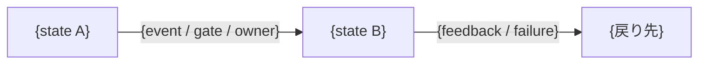

# Design: 機密情報の標準を設け、状態遷移 template を標準へ揃える

## 元の依頼内容

利用先 repository から `escalate-plugin-skill-fix` 経由で引き渡された修正提案 2 件。2 件は独立した decision である。

### 提案1: `document-review` が機密情報の観点を持っていない

md を emit する前のゲートとして `document-review` が機能しているが、当てる観点は「内容の濃さ」「記法」「命名」「指示対象」（作成時）と、そこへ「既存記述の直し方」が加わるもの（更新時）だけである。いずれも「読者が使えるか」を見るものであり、「書いてはいけないものが入っていないか」を見る観点が無い。

機密情報を document へ書かないための標準を `plugins/tumeda-dev/docs/documentation_standards/` へ設け、`document-review` から参照させる。

**必要だと分かった具体例**: public repository である利用先で、既存環境の構成情報を設計文書と議論記録へ書き、commit して公開した。含まれていたのは、本番環境と開発用 DB が同じ場所にあること、DB の port 番号、DB 側の security group が接続元を IP で絞っておらず防御が認証だけであることの 3 点。3 つ目が最も重い。到達先、port、防御の薄さが揃っており、攻撃経路をそのまま示す。発見後に除去し、公開していた branch を force push で上書きした。

対処として利用先の repository 固有 context file へ「公開範囲」の項目を足したが、これは repository 固有 fact の記載にすぎず、別の repository では同じことが起きる。

**根拠**: 根本原因として 2 つを特定した。(1) 公開範囲の確認を「これから書くもの」に限定した。別の提案が公開理由で却下された直後に確認を行ったが、対象をこれから書く document に絞り、既に書き終えていた成果物へ遡らなかった。(2) 調査の網羅性と、書いてよいかを同じ判断として扱った。調査で得た事実をそのまま設計文書の付録へ書いた。

機密情報の性質について観測した事実: credential（password、token、key）と構成情報では扱いが違う。credential は「書かない」で完結し、置き場所を分けて version 管理と同列にしない、という形で終わる。構成情報は文脈で変わる。同じ `0.0.0.0/0` という記述でも、既存環境の security group のものは除去し、その design が新たに作る security group のものは残した。後者は対策（別の層で遮断する仕組み）と対で書かれており、設計の正本として必要だったためである。この線引きは credential の規則では表現できない。

### 提案2: `task-design` の workflow template が読めない記法を規定している

`plugins/tumeda-dev/skills/task-design/templates/outcome-sections/workflow.md` の「状態と遷移」placeholder が、```text のコードブロック内で `{state A} --{event / gate / owner}--> {state B}` という mermaid 風の記法を規定している。

この形はどちらの媒体でも読めない。terminal では mermaid がレンダリングされないため記号列がそのまま出る。markdown viewer では ```text なのでコードブロックとして表示され、やはり図にならない。

**必要だと分かった具体例**: この template を使って書いた設計文書の状態遷移が、text ブロックなのに mermaid 記法という状態になり、利用者から「mermaid のコードブロックのタイプを text にすればいいわけじゃない。読めない記法になるだけ」と指摘された。別の repository で同じ template を使って書かれた設計文書も同じ形になっており、template 由来であることが確認できる。

**根拠**: 推定される経緯は、「terminal で mermaid がレンダリングされないのでアスキーアートにしてほしい」という要求に対し、記法をアスキーアートへ変えるのではなく、コードブロックの言語指定だけを mermaid から text へ変えたことである。要求の本質は「読める形にする」ことであり、言語指定を変えることではなかった。

---

## TL;DR

`document-review` は md を emit する前のゲートでありながら、「書いてはいけないものが入っていないか」を見る観点を持たない。機密情報の標準を `documentation_standards/` へ設け、観点として `document-review` へ組み込む。

あわせて、`task-design` の workflow template が規定する状態遷移の記法を mermaid のコードブロックへ直す。現在の形は `text` のコードブロックへ mermaid 風の記法を入れており、file としても chat としても図にならない。標準そのものは変えない。

この判断の前提として、図の記法を決める区別軸が確定した。file へ書く図は mermaid を使ってよく、chat へ出す図（セッション描画）はアスキーアートを優先する。後者のルールは `facilitate-discussion` が個別ルールとして持つ。

---

## 完成後の姿

### documentation以外のfile deliverable

**対象と読者:**

| file | 主な読者 | 読後または利用後にできること |
| --- | --- | --- |
| `plugins/tumeda-dev/docs/documentation_standards/confidentiality.md` | md を書く agent、その md を review する agent | 書こうとしている記述が機密情報にあたるかを判定し、あたる場合に何をするかを決められる |
| `plugins/tumeda-dev/skills/document-review/SKILL.md` | md を emit する前のゲートを通す agent | 機密情報の観点を、他の観点と同じ手順で当てられる |
| `plugins/tumeda-dev/skills/task-design/templates/outcome-sections/workflow.md` | 設計文書の「状態と遷移」を書く agent | 読み手が意味を取れる形で状態遷移を書ける |
| `plugins/tumeda-dev/skills/facilitate-discussion/SKILL.md` | discussion を進行する agent | discussion file と chat へ出す図を、読み手が raw text のまま読める記法で書ける。discussion file へ書く前に機密情報の判定を通せる |
| `plugins/tumeda-dev/skills/task-design/SKILL.md` | 設計成果物を書く agent | `design.md` 等へ書く前に機密情報の判定を通せる |
| `plugins/tumeda-dev/skills/steering/SKILL.md` | steering を進行する agent | `discussion.md`、`implementation_review.md` へ書く前に機密情報の判定を通せる |
| `plugins/tumeda-dev/skills/facilitate-discussion/templates/proposal-sections/process-flow.md` | process の図を含む提案を書く agent | 記法の正本が不変条件にあることを辿れる |

**完成後の内容と構造:**

機密情報の判定は「この記述が公開されたとき、それを読んだ人は何ができるようになるか」を起点にする。型（credential、構成情報、個人情報、事業上の機密）は軸ではなく、この問いから出る具体例として並べる。

判定の対象を攻撃に限定しない。攻撃は「できるようになること」の一種として扱う。型が増えても判定手順は変わらず、新しい型は具体例の列に足される。

判定は 2 段で行う。

第 1 段は論点1 の問いで機密にあたるかを判定する。できるようになることが実質無いならそのまま書く。

第 2 段は第 1 段を通ったものを識別子と構成の性質に分ける。識別子（domain 名、host 名、固定 IP、resource 名、account ID）は、その document が作る対象であっても実値を書かず変数または placeholder で参照する。構成の性質（何を許可するか、どの層で遮断するか）は、その document が作る対象なら書き、既存環境のものは書かない。

この順序が必要なのは、第 2 段だけを適用すると内部 port のような無害な識別子まで変数化することになり、document が読めなくなるためである。

実値を書くか参照にするかは repository の公開範囲に依存する。公開範囲は repository 固有の context が持ち、この標準は「識別子を実値で書く前に公開範囲を確認する」手順だけを持つ。

`workflow.md` template の「状態と遷移」placeholder は、mermaid の flowchart を規定する形にする。

````

````

placeholder の中身は現在のものを保ち、図種の宣言行、node の id、ラベルの quote を足す。この template が出力するのは `design.md` という file へ書く図であり、file へ書く図は mermaid を使ってよい。

`facilitate-discussion` は、discussion file と chat へ出す図の記法を「workflow全体で守る不変条件」で定める。アスキーアートを第一選択とし、mermaid は text で関係を保ったまま表せない複雑さがあり、かつ読み手の環境で render される場合だけ使う。`text` のコードブロックへ mermaid 記法を入れる形は使わない。対象は図全般であり、flow、状態遷移、依存関係、構成を含む。

同じ規則を述べていた `templates/proposal-sections/process-flow.md` の記述は、不変条件を参照する一文へ置き換える。正本を二箇所に持たない。

この二つの skill は所有範囲が異なる。`task-design` は `design.md` の記法を、`facilitate-discussion` は discussion file と chat の記法を持つ。媒体の判定を plugin 横断の標準として置くと、どちらかが他方の所有物へ越境するため、標準としては置かない。

機密情報の判定は、`document-review` の観点として当てるだけでは steering 成果物へ届かない。同 skill の対象は docs と skill 本体に限られ、steering の作業記録には当てないためである。今回の事故はその作業記録で起きた。

そこで、steering 成果物を書く 3 skill へ `confidentiality.md` を参照する trigger を置く。置き場所は各 skill の既存の記述規則に相当する位置であり、`task-design` は section 1 末尾の段落群、`facilitate-discussion` は `## workflow全体で守る不変条件`、`steering` は `## 記述規則` である。文言は 3 skill で同一にする。

> 成果物へ書く前に、その記述が機密情報にあたるかを [`confidentiality.md`](../../docs/documentation_standards/confidentiality.md) の判定で確認する。調査は網羅的に行ってよいが、成果物へ書く時点では別の判断が要る。判定の中身は同 file が正本であり、ここへ写さない。

各 skill は判定の中身を持たず参照だけを持つ。`document-review` が観点名と時機だけを持つ既存契約と同じ形である。

**記載する原則と例:**

機密情報の標準 file の見出し構成は次のとおり。`referent_explicitness.md` と同じ型であり、一般則と具体例を往復させ、最後に検知手段と該当しない例で境界を閉じる。

```text
# 機密情報を document へ書かない
├── ## 一般則（判定の起点）
│   └── 「この記述が公開されたとき、それを読んだ人は何ができるようになるか」を問う。型ではなくこの問いが軸であること
├── ## 判定の二段
│   ├── ### 第 1 段: 何ができるようになるか
│   │   └── できるようになることが実質無いならそのまま書いてよい。攻撃に限らず、本人への害や競合優位の喪失も含む
│   └── ### 第 2 段: 識別子と構成の性質を分ける
│       └── 識別子は実値を書かず参照にする。構成の性質はその document が作る対象なら書き、既存環境のものは書かない。第 2 段だけを先に適用すると無害な識別子まで変数化して document が読めなくなること
├── ## 型ごとの例
│   ├── ### credential
│   │   └── password、token、key。書かないで完結し、置き場所を分ける
│   ├── ### 構成情報
│   │   └── 到達先、port、防御の構成。第 2 段の判定が効く型
│   └── ### 個人情報・事業上の機密
│       └── 攻撃ではなく、本人への害や競合優位の喪失で判定される例
├── ## 公開範囲の確認
│   └── 実値を書くか参照にするかは repository の公開範囲に依存する。公開範囲そのものは repository 固有の context が持ち、この標準は「識別子を実値で書く前に確認する」手順だけを持つ
├── ## だめな例と直した形
│   └── 実際に公開された記述と、除去後の形。同じ `0.0.0.0/0` でも、既存環境のものは除去し、design が作る対象は対策と対で残した対比
├── ## 検知手段
│   └── 書き終えた document に対して何を見れば混入に気づけるか。調査の網羅性と、書いてよいかの判断が別であること
└── ## 該当しない例
    └── 内部 port、変数名、公開 API の endpoint 名など、第 1 段で落ちるもの
```

事故の現物は「だめな例と直した形」に置き、経緯を document の先頭へ置かない。この標準の主用途は書く前の判定であり、開いた読者が上から読んで判定できる順序にする。

**配置・形式:**

- 機密情報の標準の配置: `plugins/tumeda-dev/docs/documentation_standards/confidentiality.md`。`README.md` の「標準の置き方」が「各標準は基本 1 ファイル」と定めており、今回は 1 file に収まる。file 名は同階層の観点名（`content_density.md`、`expression_notation.md`）と抽象度を揃え、型を名指ししない形にした。
- 形式: Markdown。同 directory の既存標準と同じ粒度。
- 参照する既存pattern: `referent_explicitness.md`（一般則を示し、埋めるべき条件を列挙し、型ごとのだめな例と直した形を並べ、検知手段を最後に置く構成）
- 正本と重複防止: `expression_notation.md` は document、すなわち file へ書くものの記法標準であり、今回これを変更しない。chat へ出す図のルールは document の標準が扱う対象ではなく、`facilitate-discussion` が個別ルールとして持つ。機密情報の標準と `expression_notation.md` の間に重複は生じない。

---

### documentationによって成立する知識体系

**形式知化する対象:**

- 暗黙知・散在知識・pain: 機密情報を document へ書かない判断が、書き手の注意力だけに委ねられている。利用先 repository の固有 context へ「公開範囲」を書いても、それは repository 固有 fact であり、別の repository では同じ事故が起きる。
- 再利用可能な原則へ引き上げるもの: 機密情報の判定を「この記述が公開されたとき、それを読んだ人は何ができるようになるか」という一つの問いへ還元したこと（論点1）。その問いを通ったものを識別子と構成の性質に分け、識別子は実値を書かず参照にし、構成の性質はその document が作る対象なら書くという二段判定（論点2）。判定を当てる時機を document の種類で絞らず、作成時と更新時の両方へ無条件に置くこと（論点3）。いずれも repository を問わず当たる。

**読者と成立させる判断:**

| 読者 | 利用場面 | codeや過去会話を再調査せず可能になる判断・action | 入口 |
| --- | --- | --- | --- |
| md を書く agent | 調査で得た事実を成果物へ書こうとしている | この記述が機密情報にあたるか。あたる場合に書かないのか、形を変えて書くのか | `documentation_standards/confidentiality.md` |
| md を review する agent | emit 前のゲートを通している | 機密情報の観点をいつ当てるか、満たさない場合にどう扱うか | `document-review/SKILL.md` の観点 list |

**知識構造:**

判定の正本は `confidentiality.md` が単独で持つ。構成は論点7 のとおり、一般則（判定の起点）から二段判定へ進み、型ごとの例で具体化し、公開範囲の確認、だめな例と直した形、検知手段、該当しない例で閉じる。

参照する側は中身を写さない。`document-review/SKILL.md` は観点名と当てる時機だけを持ち、`task-design` / `facilitate-discussion` / `steering` は「書く前に判定を通す」という trigger だけを持つ。参照は 4 箇所あるが、判定基準の複製は生じない。

repository ごとの公開範囲は `confidentiality.md` が持たない。repository 固有の context が持ち、標準は「識別子を実値で書く前に公開範囲を確認する」手順だけを持つ。この分担により、標準は repository を問わず当たり、公開範囲だけを repository ごとに変えられる。

**規範の根拠と適用境界:**

根拠は、公開 repository の設計文書と議論記録へ既存環境の構成情報を書き、commit して公開した事故である。到達先、port、防御の薄さが揃った記述が含まれ、攻撃経路をそのまま示していた。書き手の注意力だけに委ねると再発する。

適用境界は二層に分かれる。`document-review` が当てる範囲は docs と skill 本体であり、この境界は変更しない。steering 成果物へは各 skill の trigger が当たる。両方を合わせて、この plugin の workflow が書く document を覆う。

覆わないのは、plugin の workflow の外で書かれる document である。利用先 repository の README や設計文書を、これらの skill を通さずに書く場合、標準は自動では当たらない。標準 file 自体は repository を問わず読めるため、利用先が明示的に参照することはできる。

**snapshotと維持規律:**

| 正しいsnapshot | single source of truth | 更新owner | 更新trigger |
| --- | --- | --- | --- |
| 機密情報の判定基準 | `documentation_standards/confidentiality.md` | 判定基準を変える人 | 新しい型の機密情報が判明したとき |
| emit 前に当てる観点の一覧 | `document-review/SKILL.md` | 観点を増減する人 | 標準の追加・削除 |

`document-review/SKILL.md` は観点の名前といつ当てるかだけを持ち、当て方の中身は標準 file が持つ。これは既存の契約であり、今回もこれに従う。

---

## 要件（Requirements）

### MUST（必達）

- 機密情報を document へ書かないための標準が `documentation_standards/` 配下に存在する。
- `document-review` がその標準を観点として当てる。当てる時機（作成時、更新時、ケース別のいずれか）が確定している。
- `workflow.md` template の「状態と遷移」placeholder が、読み手が意味を取れる記法を規定している。

### SHOULD（できれば）

- 標準が、credential と構成情報で扱いが違うことを表現できている。
- 今回の事例（既存環境の構成は書かず、design が作る対象は対策と対で書いた）が、判断の具体例として読める。

### MAY（あれば嬉しい）

- なし

### 非目標

- 利用先 repository の `.agents/skills/` 配下にある repository 固有 context の内容を変えること。あれは repository 固有 fact であり、この plugin の管轄外である。
- 機械的な検知の仕組み（pre-commit hook 等）を plugin へ持ち込むこと。判定の起点が「何ができるようになるか」という文脈判断であり、文字列 pattern では代替できない。同じ `0.0.0.0/0` でも既存環境のものは書かず、design が作る対象なら対策と対で書くという区別は、文字列が同一のまま判断だけ逆になる。あわせて plugin が配布するのは skill と docs であり、利用先 repository の git hook を管理する構造を持たない。機械検知が効く型と効かない型の区別は `confidentiality.md` の「検知手段」節に書き、利用先が独自に持つ場合の判断材料にする。

### 受け入れ基準

- `documentation_standards/confidentiality.md` が存在し、論点7 で合意した見出し構成を持つ。
- 同 file が `document-review` を通っている。
- `document-review/SKILL.md` の作成時観点と更新時観点の両方に「機密性 → `confidentiality.md`」がある。
- `task-design` / `facilitate-discussion` / `steering` の SKILL.md に、論点10 で合意した文言の trigger がある。相対 path が解決する。
- `task-design/templates/outcome-sections/workflow.md` の「状態と遷移」が mermaid の flowchart を規定している。
- `facilitate-discussion/SKILL.md` の不変条件に図の記法があり、`process-flow.md` が同じ規則を重複して持たない。
- 引き渡された具体例（既存環境の構成情報を公開した事故）を `confidentiality.md` の判定へ当てたとき、除去する記述と残す記述を判定できる。

---

## リスクと対策

| リスク | 対策 |
| --- | --- |
| 標準が「機密情報を書くな」という一般論に留まり、判定に使えない | 見出し構成を判定手順で組む（論点7）。一般則の次に二段判定を置き、型ごとの例と「だめな例と直した形」で具体化する。受け入れ基準に「引き渡された具体例を判定へ当てて、除去する記述と残す記述を判定できること」を置き、一般論のままでは満たせないようにする |
| 観点を増やしたことで `document-review` の適用コストが上がり、省略されるようになる | 判定の第 1 段で大半が落ちる構成にする。「できるようになることが実質無いならそのまま書いてよい」を先に置き、二段目まで進むものを絞る。また `document-review` へ足すのは観点名と参照だけであり、skill 本文は肥大しない |

---

## テスト方針

- `confidentiality.md` は `document-review` を通す。これが document に対する検証である。
- skill と template の変更は、参照先 file が存在すること、および相対 path が解決することを確認する。
- 自動 test は無い。plugin が配布するのは skill と docs であり、実行可能な code を持たない。

---

## （付録）前提とする既存仕様

- **`documentation_standards/README.md` の「標準の置き方」**: 「標準を増やしたら、それが emit 前に当てる観点かを判断する。観点なら `document-review` の観点 list へ足す。判断の問いは『この標準は、書かれた文に当てて、満たすか満たさないかを判定できるか』。何を書くか・どこに置くか・誰に向けて書くかを扱う標準は観点でない。これらは `document-review` の能力境界の外である」と定めている。各標準は基本 1 ファイルとし、複数 file が要る場合だけ directory 化してよいとも定めている。
- **`document-review` の観点構成**: 作成時観点は内容の濃さ（`content_density.md`）、記法（`expression_notation.md`）、命名（`file_naming.md`）、指示対象（`referent_explicitness.md`）。更新時観点は内容の濃さ、記法、指示対象、既存記述の直し方（`modify_description_policy.md`）。ケース別観点は「今は無し。必要になったら、ここに追加する」とされている。
- **`document-review` の能力境界**: 「何を書くべきかという知識の取捨選択は `doc-enricher` が担う。この skill は書かれたものが観点を満たすかだけを見る」。また「観点の名前と、いつ当てるかだけを持ち、当て方の中身は標準 file が正本であり、skill 本文へ写さない」。
- **`expression_notation.md` の図の描き方**: 「図にすると決めたら、描き方は 2 つ。**まず mermaid を試し、それで無理なときだけアスキーアートに落とす**」。mermaid を第一選択とする理由は「フローチャート・シーケンス図・**状態遷移**・ER 図・クラス図など、箱と線・矢印で表せる構造はほぼ mermaid で書ける。レンダリングが安定し記法も共通なので、図にするなら基本はこれ」。アスキーアートは「mermaid に無い図形や、レイアウトを手で細かく制御したいときの逃げ道」と位置づけられている。
- **`workflow.md` template の修正前の状態**: 「状態と遷移」placeholder が ```text のコードブロック内で `{state A} --{event / gate / owner}--> {state B}` を規定していた。この形は file としても chat としても図にならない。論点4 で mermaid の flowchart へ変更した。
- **plugin 内の mermaid 記法**: `how_to_write_workflow.md` と `facilitate-discussion/SKILL.md` はいずれも `flowchart` を使い、ラベルを `"` で囲む（`G{"条件を判定する"}`）。`stateDiagram-v2` の使用例は無い。
- **`facilitate-discussion` が既に持っていた記法規則（修正前）**: `templates/proposal-sections/process-flow.md` が「discussionの提案はfileだけでなくchatにも提示されるため、render済みMarkdownとraw textの両方で判断対象を読める記法を選ぶ」「短いflowは、sourceのまま読める`text`表現を第一選択にする。Mermaidは、textでは関係を保ったまま表せない複雑さがあり、かつ実際に判断するchatまたはviewerでinline renderされる場合だけ使う」と定めていた。内容は今回確定したルールとほぼ一致する。ただし同 file の「使用条件」が process、workflow、思考手順の図に限定されており、状態遷移や構成の図へは当たらなかった。論点6 で不変条件へ移した。
- **図の記法を決める区別軸（論点4 で確定）**: file へ書く図は mermaid を使ってよい。file は後から markdown viewer や GitHub で開ける。chat へ出す図はアスキーアートを優先する。terminal 上で読まれ、renderer が無い。`text` のコードブロックへ mermaid 記法を入れる形はどちらにも属さず、file としても chat としても図にならない。
- **既存標準の構成 pattern**: `referent_explicitness.md` は「一般則（許可から始める）」「埋めるべき三条件」「判定の問い」「型ごとのだめな例と直した形」「検知手段」「該当しない例」の順で構成されている。`modify_description_policy.md` は「原則」「なぜ起きるか」「実際に落ちた現物」「戻した基準」「守る点」「検知」の順。いずれも一般則と具体例を往復させ、最後に検知手段を置く。
- **`documentation_standards/` の既存標準一覧**: `core_readers.md`（読者の物差し）、`content_density.md`（濃さ）、`information_structuring/`（構造化）、`case_coverage/`（網羅）、`expression_notation.md`（記法）、`how_to_write_workflow.md`（workflow 記述）、`business_specification.md`（記載レベル）、`modify_description_policy.md`（既存 doc の直し方）、`stock-and-flow-information.md`（情報の寿命）、`supplier-consumer-relation.md`（supplier と consumer）、`file_naming.md`（命名標準へのポインタ）、`referent_explicitness.md`（指示対象）。

---

## （付録）変更の実行区分

### task-design内で対象成果物へ適用済み

| 変更 | 内容 | validation | 参照する design section |
| --- | --- | --- | --- |
| `workflow.md` template の「状態と遷移」placeholder | ```text のコードブロックから mermaid の flowchart へ変更 | plugin 内の既存 mermaid（`how_to_write_workflow.md`、`facilitate-discussion/SKILL.md`）と同じ図種・同じ quote 形式であることを確認 | 「完成後の姿 > documentation以外のfile deliverable」 |
| `facilitate-discussion/SKILL.md` の不変条件 | discussion file と chat へ出す図の記法を 1 項目として追加 | 既存の chat 向け表示規則（判断対象の特定）と同じ位置・同じ粒度であることを確認 | 同上 |
| `process-flow.md` の記法記述 | 同じ規則を述べる 2 記述を削り、不変条件を参照する一文へ置換 | 削除後も「使用条件」「template」節が単独で成立することを確認 | 同上 |
| `documentation_standards/confidentiality.md`（新規） | 論点7 の見出し構成に沿って本文を執筆 | `document-review` を通した。初回に濃さ不足（第 1 段が 3 要素のうち「外れているときどう見えるか」を欠き、現物も無い）と指示対象（`repository 固有の context` の実体が定まらない）を検知し、第 1 段を書き直して `maintenance-plugin-context` を明示。再レビューで指摘尽き。あわせて標準を自身へ適用し、「だめな例」を実事故の再現ではなく架空の例に置き換えた。引き渡された具体例 4 件（既存環境の host 同居、port、security group の開放、design が作る security group の開放）を判定へ当て、前 3 件が第 2 段で落ち、4 件目が残ることを確認した | 「完成後の姿 > documentation以外のfile deliverable」「記載する原則と例」 |
| `document-review/SKILL.md` | 作成時観点と更新時観点へ「機密性 → `confidentiality.md`」を追加。あわせて役割節へ、機密性だけ判定の向きが逆であることを 1 文で補足した。観点 list へ足すだけでは、役割節の「読者がその doc で作業できる状態に達しているかを判定する」という記述と食い違うため | 両観点 list に項目があること、参照先 file が存在することを確認 | 「完成後の姿 > documentationによって成立する知識体系」 |
| `task-design` / `facilitate-discussion` / `steering` の SKILL.md | 論点10 の文言で trigger を追加。`task-design` は section 1 末尾の段落、`facilitate-discussion` は `## workflow全体で守る不変条件`、`steering` は `## 記述規則` | 3 skill いずれからも相対 path `../../docs/documentation_standards/confidentiality.md` が解決することを script で確認 | 同上 |

### task-design内の対象成果物反映待ち

なし

### execution plan対象

なし

変更はいずれも合意済み decision から一意に導かれ、実行時に段階を踏む必要が無いため、task-design 内で適用して validation まで終えた。

### 分類保留（設計中のみ）

なし
