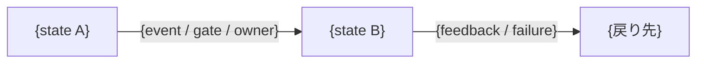
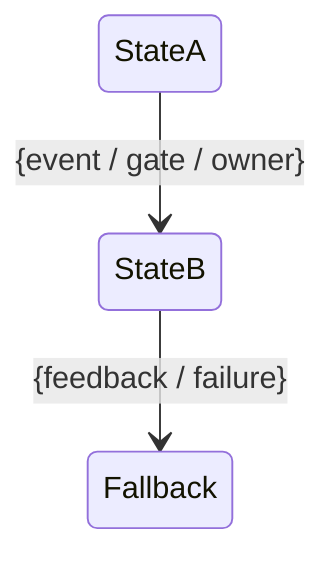

# 議論記録

## 論点1: 何を機密とするかを、どの軸で分類するか

**ステータス:** 決定済み

**種別:** TBDヒアリング

### イテレーション0: 分類の軸を決める

#### 提案0

**推奨:** d。将来の型を同じ問いで判定でき、判定の対象を攻撃に限定しないため。

- **a. 対象物の種類で分ける（credential / 構成情報）**
  - 引き渡された観測事実をそのまま軸にする。具体的で、書き手が自分の記述を当てやすい。
  - 軸が「もの の種類」であるため、種類が増えるたびに軸を足すことになる。個人情報、顧客データ、事業上の機密（価格戦略等）はどちらにも入らない。
  - 増やし続けると、判定のたびに全種類を思い出して照合する形になる。照合漏れが起きたとき、漏れたことに気づけない。
- **b. 性質で分ける（それ自体が鍵になるもの / 組み合わせると攻撃経路になるもの）**
  - credential は前者、構成情報は後者。種類ではなく性質なので、新しい型も「どちらの性質か」で振り分けられる。
  - ただし軸が攻撃に寄っている。個人情報が漏れて困るのは攻撃されるからではなく、本人へ害が及ぶからである。この軸では個人情報を置く場所が無い。
- **c. 判定の問いを主にし、分類は具体例の並べ方として従にする**
  - 問いは「この記述と、公開されている他の情報を組み合わせると、攻撃の手がかりになるか」。
  - 分類を軸にしない分、型の増加に強い。ただし b と同じく攻撃に限定されており、攻撃以外の害を判定できない。
- **d. 「公開されたら誰が何をできるようになるか」を判定の起点にし、型はその具体例として並べる**
  - 問いは「この記述が公開されたとき、それを読んだ人は何ができるようになるか」。
  - credential なら「その credential で認証を通せる」。構成情報なら「到達先を知り、防御の薄い箇所を狙える」。個人情報なら「本人を特定できる」。事業上の機密なら「競合が戦略を知る」。いずれも同じ問いから出る。
  - 判定の対象を攻撃に限定しない。攻撃は「できるようになること」の一種として扱われる。
  - 型は軸ではなく具体例になるため、増えても判定手順が変わらない。新しい型は具体例の列に足される。

#### 提案背景

**この論点を最上位に置く理由**

標準の見出し構成、`document-review` へ足す観点の粒度、観点を当てる時機が、すべてこの分類に依存する。分類が決まらないと、標準が「機密情報を書くな」という判定に使えない一般論に留まる。

`documentation_standards/README.md` は、標準を増やすときの判断の問いを「この標準は、書かれた文に当てて、満たすか満たさないかを判定できるか」と定めている。判定できる形にすることが、この標準が観点として成立する条件である。

**3 案を出した後に気づいた共通の問題**

当初の案 a、b、c はいずれも攻撃を前提にしていた。b は「攻撃経路になるか」、c は「攻撃の手がかりになるか」を軸に置いている。

しかし機密情報が漏れて困る理由は攻撃だけではない。個人情報は本人へ害が及ぶことが問題であり、事業上の機密は競合優位の喪失が問題である。攻撃を軸にすると、これらを判定できない。

この plugin が扱う repository には個人情報や事業上の機密を含む document が今後現れうる。攻撃に限定した軸を採ると、その時点で軸を作り直すことになる。

**判定の難しさがどこにあるか**

今回の事故で判定を誤ったのは、機密だと分かった後の扱いではなく、機密かどうかの判定そのものである。credential であれば気づく。port 番号単体、security group の設定といった構成情報では気づかなかった。

気づけない理由は 2 つある。

- 単体では無害に見える。port 番号だけを見て機密だと判定するのは難しい。
- 組み合わせで意味を持つ。到達先、port、防御の薄さが揃って初めて攻撃経路になる。

d の問い（公開されたら誰が何をできるようになるか）は、この 2 つに対応する。単体で無害に見えるものでも「読んだ人が何をできるか」を問えば、組み合わせた結果が視野に入る。

#### 提案0へのフィードバック

**結果:** d を採用。

> d

### 決定

機密情報の判定は、**「この記述が公開されたとき、それを読んだ人は何ができるようになるか」**を起点にする。型（credential、構成情報、個人情報、事業上の機密）は軸ではなく、この問いから出る具体例として並べる。

この形を採る理由は 2 つある。

判定の対象を攻撃に限定しない。攻撃は「できるようになること」の一種として扱われる。個人情報が漏れて困るのは本人へ害が及ぶからであり、事業上の機密は競合優位の喪失が問題である。攻撃を軸にするとこれらを判定できない。

型が増えても判定手順が変わらない。新しい型は具体例の列に足されるだけで、軸そのものは動かない。型を軸にすると、判定のたびに全種類を照合する形になり、照合漏れに気づけない。

## 論点2: 構成情報について「書いてよい場合」をどう表現するか

**ステータス:** 決定済み

**親論点:** 論点1

**種別:** TBDヒアリング

### イテレーション0: 書いてよい場合の線引きを決める

#### 提案0

**推奨:** b。今回の事例が示す線引きを一般則として表現でき、かつ起点以外の case でも意図した場所へ落ちるため。

- **a. 対策と対になっているかで決める**
  - 防御の仕組みと対で書かれていれば書いてよい。単独で「防御が無い」とだけ書くなら書かない。
  - 今回の事例では、`0.0.0.0/0` を「IP 直アクセスは別の層で弾く」と対で書いた記述は残し、「接続元を絞っておらず防御が認証だけ」という記述は消した。この線引きを直接表現できる。
  - ただし「対策を併記すれば何でも書ける」と読まれる余地がある。実際には、対策を書いても到達先そのものが機密であるものは書けない。
- **b. その document が作る対象か、既存環境の状態かで決める**
  - その design が新たに作るものの構成は、設計の正本として必要なので書く。既に存在する環境の構成は書かない。
  - 今回の事例に当てはめると、design が作る security group の `0.0.0.0/0` は前者、既存 DB 側の security group は後者。実際の判断と一致する。
  - 根拠は、設計文書が「これから作るもの」を合意する場であること。既存環境の状態は、その合意に必要な範囲を超えて書くと、調査結果の転記になる。
  - 対策の併記は、書いてよいと決まった後の**書き方**の問題として別に扱える。
- **c. 読み手が実行できる形かどうかで決める**
  - 到達先、認証情報、防御の弱点が揃っていれば書かない。どれか欠けていれば書いてよい。
  - 組み合わせの問題を直接扱える。ただし「どれか欠けていればよい」は危うい。欠けている部分を別の document が持っていれば、合わせて揃う。
  - 単一 document 内で完結しない判定になるため、書き手が判定しきれない。

#### 提案背景

**この論点が論点1 の child である理由**

論点1で判定の起点を「公開されたら誰が何をできるようになるか」に決めた。この問いを構成情報へ当てると「到達先を知り、防御の薄い箇所を狙える」となり、書かない方向へ倒れる。

しかし今回の事例では、構成情報の一部を**書いた**。design が作る security group の `0.0.0.0/0` は設計の正本として必要であり、消せば設計が成立しない。つまり論点1 の問いだけでは、書いてよい場合を判定できない。この差を埋める規則が要る。

**起点以外の case で検証する**

今回の事例（既存 DB の security group vs design が作る security group）は b を導いた起点であるため、b がその case で成立するのは当然である。起点以外の case を 2 つ当てる。

*case 1: 既存の CI/CD が GitHub 側に AWS credentials を持たない構成であることを、新しい環境の設計文書へ書く場合*

これは既存環境の状態である。b では「書かない」へ倒れる。

しかし実際には、この事実は「新しい環境でも GitHub 側に credentials を置かない」という設計判断の根拠であり、書く価値がある。b をそのまま当てると、設計の根拠が書けなくなる。

ここから分かるのは、b の「既存環境の状態は書かない」が広すぎることである。既存環境の状態のうち、**防御の有無や到達先に関わるもの**だけが対象になる。「credentials を置いていない」は防御が有る側の事実であり、公開しても読んだ人ができることが増えない。

*case 2: 使用している framework のバージョンを document へ書く場合*

既存環境の状態である。b をそのまま当てると書けない。

しかし version 情報は、既知の脆弱性と結び付けば攻撃の手がかりになる一方、設計判断の前提としても必要になる。論点1 の問いを当てると「その version の既知の脆弱性を調べられる」となり、書かない方向へ倒れる。

ここでも b 単独では判定しきれず、論点1 の問いと組み合わせる必要がある。

**検証から導かれること**

b は「既存環境か、作る対象か」を第一の篩にするが、それだけでは広すぎる。論点1 の問い（公開されたら何ができるようになるか）を通した上で、b を適用する順序になる。

提案 b はこの順序を含む形で表現する。すなわち、まず論点1 の問いで機密にあたるかを判定し、あたる場合に「その document が作る対象か」で書いてよいかを決める。

a を採らないのは、対策の併記を判定基準にすると「対策を書けば何でも書ける」と読まれるためである。対策の併記は書き方の問題であり、書いてよいかの判定とは層が違う。

c を採らないのは、単一 document 内で判定が完結しないためである。欠けている情報を別 document が持っていれば揃ってしまうが、書き手はそれを確認できない。

#### 提案0へのフィードバック

**結果:** b では扱えない反例が示された。提案の前提が誤っていた。

> bで良い気もするけど、これから作る環境の設計やその永続化先のREADMEにドメイン名とかベタ書きしちゃわない？

指摘のとおりである。b を今回の事例へ当て直すと、実際の判断と矛盾する箇所がある。

作った review 環境の domain 名は「その design が作る対象」にあたる。b をそのまま適用すると「書いてよい」へ倒れる。しかし実際には、利用者から public repository であることを理由に指摘され、document では変数を参照する表記へ置き換えた。対象 repository の terraform も同じ扱いで、domain を変数化していた。

提案0は構成の性質（security group が何を許可するか）だけを見て線引きを導いており、識別子（domain 名、host 名、port、resource 名）を視野に入れていなかった。

### イテレーション1: 識別子と構成の性質を分け、判定の順序を確定する

#### 提案1

判定を 2 段にする。

**第 1 段: 論点1 の問いで、機密にあたるかを判定する**

「この記述が公開されたとき、それを読んだ人は何ができるようになるか」。できるようになることが実質無いなら、以降の判定は不要で、そのまま書いてよい。

**第 2 段: 機密にあたるものを、識別子と構成の性質に分ける**

| 種別 | 内容 | 扱い |
| --- | --- | --- |
| 識別子 | domain 名、host 名、固定 IP、resource 名、account ID など、対象を一意に指す値 | その document が作る対象であっても実値を書かない。変数または placeholder で参照する |
| 構成の性質 | 何を許可するか、どの層で遮断するか、どの経路を通るかなど、対象の振る舞いを表すもの | その document が作る対象なら書く。既存環境のものは書かない |

識別子を作る対象であっても書かないのは、識別子が到達先そのものだからである。構成の性質は「その設計がどう動くか」の説明であり、設計の正本として必要になる。識別子は変数で参照でき、参照にしても設計の理解が損なわれない。

実値を書くか参照にするかは、その repository の公開範囲に依存する。公開範囲そのものは repository 固有の context が持ち、この標準は「識別子を実値で書く前に公開範囲を確認する」という手順だけを持つ。

#### 提案背景

**今回の全判断で検証する**

提案0の検証では case を 2 つしか当てておらず、識別子を含む case を当てていなかった。今回の事例で実際に行った判断を 5 つ並べ、提案1 がすべてを説明できるかを確認する。

| 記述 | 第 1 段（何ができるようになるか） | 第 2 段 | 実際の判断 | 一致 |
| --- | --- | --- | --- | --- |
| 既存 DB の security group が接続元を絞っていない | 防御の薄い箇所を狙える | 既存環境の構成の性質 | 除去した | 一致 |
| design が作る task の security group が特定 port を全開放する | その port を狙える。ただし別の層で遮断する仕組みと対で書かれている | 作る対象の構成の性質 | 残した | 一致 |
| 作る環境の domain 名 | 到達先を特定できる | 作る対象の識別子 | 変数参照へ置き換えた | 一致 |
| 既存 DB の port 番号 | 到達先の一部を特定できる | 既存環境の識別子 | 除去した | 一致 |
| design が作る task の port 番号 | 到達先を特定できない。public IP は起動ごとに変わり停止中は存在せず、Host ヘッダが異なれば遮断される | 第 1 段で機密にあたらない | 残した | 一致 |

5 件すべてが一致する。提案0では 5 件目と 3 件目を説明できなかった。

**5 件目が示すこと**

design が作る task の port は識別子だが、第 1 段で機密にあたらないと判定される。到達先を特定するには IP が要り、その IP は起動ごとに変わって停止中は存在しない。さらに Host ヘッダによる遮断がある。

つまり識別子であっても、単体で到達先にならないものは第 1 段で落ちる。第 2 段の「識別子は書かない」は、第 1 段を通ったものだけに適用される。この順序が無いと、内部 port のような無害な識別子まで変数化することになり、document が読めなくなる。

**公開範囲を標準が持たない理由**

同じ domain 名でも、private repository の document なら実値を書いてよい場合がある。公開範囲は repository ごとに違い、この plugin は利用先の公開範囲を知らない。

したがって標準が持つのは「識別子を実値で書く前に、その repository の公開範囲を確認する」という手順までである。公開範囲そのものは利用先の repository 固有 context が持つ。

今回の事例で利用先 repository の固有 context へ「公開範囲」を足したのは、この層として正しかった。足りなかったのは、確認するという手順を定める標準の側である。

#### 提案1へのフィードバック

**結果:** 受諾。

> ok

### 決定

機密情報の判定を 2 段で行う。

**第 1 段**: 論点1 の問い「この記述が公開されたとき、それを読んだ人は何ができるようになるか」で、機密にあたるかを判定する。できるようになることが実質無いなら、以降の判定は不要でそのまま書いてよい。

**第 2 段**: 第 1 段を通ったものを、識別子と構成の性質に分ける。

- **識別子**（domain 名、host 名、固定 IP、resource 名、account ID など、対象を一意に指す値）: その document が作る対象であっても実値を書かない。変数または placeholder で参照する。識別子は到達先そのものであり、参照にしても設計の理解が損なわれないため。
- **構成の性質**（何を許可するか、どの層で遮断するか、どの経路を通るかなど、対象の振る舞いを表すもの）: その document が作る対象なら書く。既存環境のものは書かない。構成の性質は「その設計がどう動くか」の説明であり、設計の正本として必要になるため。

この順序が必要なのは、第 2 段だけを適用すると内部 port のような無害な識別子まで変数化することになり、document が読めなくなるためである。

実値を書くか参照にするかは、その repository の公開範囲に依存する。公開範囲そのものは repository 固有の context が持ち、この標準は「識別子を実値で書く前に公開範囲を確認する」という手順だけを持つ。

## 論点3: 機密情報の観点をいつ当てるか

**ステータス:** 決定済み

**親論点:** 論点1

**種別:** TBDヒアリング

### イテレーション0: `document-review` のどの観点 list へ足すかを決める

#### 提案0

**推奨:** a。判定を挟むと、判定を誤った経路だけが標準に触れないまま進むため。

- **a. 作成時観点と更新時観点の両方へ足す**
  - 新規作成でも更新でも無条件に当てる。
  - `document-review` は既に「新規作成は作成と更新の両方にあたるため、作成時観点と更新時観点の両方を当てる」と定めており、両方へ足せば全経路で当たる。
  - 根拠は `development_standards/README.md` の「今回は命名判断を含むか、entity 設計に該当するかを自分で判定しない。判定を挟むと、判定を誤った経路だけが標準に触れないまま進み、その経路では判定を誤った自覚が残らない」という構造。機密情報も同じ性質を持つ。「この document は機密情報を含みうるか」を先に判定させると、含まないと誤判定した経路だけが標準に触れない。
  - 当てるコストは、第 1 段の問いを一度通すだけで済む。機密にあたらなければそこで終わる。
- **b. ケース別観点へ足す**
  - `document-review` の「ケース別観点」は現在空で、「必要になったら、ここに追加する」とされている。枠としては用意されている。
  - ただしケース別は「成果物や状況に応じて足す観点」であり、当てるかどうかの判定が前段に入る。その判定を誤ると標準に触れないまま通る。
  - infra 系 document だけに当てる形にすると、今回のような設計文書や議論記録が対象から外れる。実際に事故が起きたのは設計文書と議論記録だった。
- **c. 作成時観点だけへ足す**
  - 新規作成時に一度当てれば足りるという考え方。
  - 更新で機密情報が混入する経路を塞げない。調査で得た事実を既存 document へ追記する場面は頻繁にあり、今回の事故も「既に書き終えていた成果物へ遡らなかった」ことが根本原因の一つだった。

#### 提案背景

**この論点が論点1 の child である理由**

論点1で判定の起点が決まり、論点2で判定の段階が決まった。残るのは、その判定をいつ実行するかである。`document-review` が観点をどこへ置くかによって、当たる経路が変わる。

**`documentation_standards/README.md` が定める条件は既に満たされている**

「標準を増やしたら、それが emit 前に当てる観点かを判断する。判断の問いは『この標準は、書かれた文に当てて、満たすか満たさないかを判定できるか』」。

論点1と論点2で決めた判定は、書かれた文へ当てて「機密にあたるか」「識別子か構成の性質か」を判定できる形になっている。したがって観点として `document-review` の観点 list へ足す対象である。この点は決定済みであり、この論点は「どの list へ足すか」だけを扱う。

**今回の事故がどの経路で起きたか**

事故は 2 段階で起きた。

1. 設計文書の付録へ、調査で得た事実をそのまま書いた（新規作成）
2. 別の提案が公開理由で却下された直後に公開範囲を確認したが、既に書き終えていた成果物へ遡らなかった（更新時の見落とし）

1 は作成時観点で捕まる。2 は更新時観点が必要になる。c では 2 を塞げない。

**b を採らない理由をもう一段**

ケース別観点は、判定が前段に入る点が問題である。加えて、機密情報がどの種類の document に現れるかは事前に決まらない。今回の事故は infra の設計文書で起きたが、同じことは API の設計文書でも、調査結果の記録でも起きうる。種類で絞ると、絞った外で起きたときに気づけない。

#### 提案0へのフィードバック

**結果:** 受諾。

> a

### 決定

機密情報の観点を `document-review` の作成時観点と更新時観点の両方へ足す。新規作成でも更新でも無条件に当てる。

ケース別観点へ置かないのは、当てるかどうかの判定が前段に入るためである。`development_standards/README.md` が「判定を挟むと、判定を誤った経路だけが標準に触れないまま進み、その経路では判定を誤った自覚が残らない」と述べている構造がそのまま当てはまる。「この document は機密情報を含みうるか」を先に判定させると、含まないと誤判定した経路だけが標準に触れない。

作成時観点だけにしないのは、更新で混入する経路を塞げないためである。今回の事故は 2 段階で起き、一つ目は新規作成（設計文書の付録へ調査結果をそのまま書いた）、二つ目は更新時の見落とし（既に書き終えていた成果物へ遡らなかった）だった。

機密情報がどの種類の document に現れるかは事前に決まらない。今回は infra の設計文書だったが、API の設計文書でも調査結果の記録でも起きうる。種類で絞ると、絞った外で起きたときに気づけない。

## 論点4: `workflow.md` template の状態遷移記法をどう直すか

**ステータス:** 決定済み

**種別:** レビュー指摘

### イテレーション0: template と標準のどちらを直すかを決める

#### 提案0

**推奨:** b。template は標準違反なので直す。あわせて同じ失敗形が再発しないよう標準へ記録する。媒体の考慮は今回の材料では決めきれない。

- **a. template を標準へ揃えるだけ**
  - `workflow.md` の「状態と遷移」placeholder を ```mermaid のコードブロックへ変える。標準は変えない。
  - 最小の変更で、template の標準違反は解消する。
  - ただし「```text へ mermaid 記法を入れる」という失敗形が標準のどこにも記録されず、同じ間違いが別の template で起きうる。
- **b. template を揃え、標準へ失敗形を追記する**
  - a に加えて、`expression_notation.md` の「アスキーアート」の項へ、コードブロックの言語指定だけを変えて記法を変えない失敗形を追記する。
  - 今回の経緯そのものが具体例になる。「terminal で mermaid がレンダリングされないのでアスキーアートにしてほしい」という要求に対し、記法をアスキーアートへ変えず言語指定だけを mermaid から text へ変えた。結果どちらの媒体でも読めなくなった。
  - `expression_notation.md` は既に「アスキーアートに手が伸びたら、まず箇条書きで代替できないかを疑う」という失敗形を持っており、同じ位置へ足せる。
- **c. 標準へ媒体の考慮を足す**
  - `expression_notation.md` は mermaid を第一選択とする理由を「レンダリングが安定し記法も共通なので」と述べている。しかし terminal では mermaid はレンダリングされない。標準は読む媒体を考慮していない。
  - 媒体によって選び分ける形へ標準を変えることになる。
  - ただし「どの成果物がどの媒体で読まれるか」の判断基準を別途決める必要があり、今回の材料では決めきれない。

#### 提案背景

**調査で判明した、提案の前提の変化**

引き渡された提案は「読める記法をどう決めるか」という形だったが、調査の結果、`expression_notation.md` が既に判断を持っていることが分かった。

> 図にすると決めたら、描き方は 2 つ。**まず mermaid を試し、それで無理なときだけアスキーアートに落とす**
> mermaid（第一選択）: フローチャート・シーケンス図・**状態遷移**・ER 図・クラス図など、箱と線・矢印で表せる構造はほぼ mermaid で書ける

状態遷移は名指しで mermaid の対象に入っている。`workflow.md` template が ```text 内へ mermaid 風記法を置いているのは、この標準への違反である。

つまりこの論点は「判断軸を新たに決める」問題ではなく、「template が標準に違反している」問題である。

**標準が想定していない第三の状態**

標準は mermaid かアスキーアートかの二択を示している。「```text のコードブロックへ mermaid 記法を入れる」という状態は、どちらでもない。

この状態はどちらの媒体でも読めない。terminal では mermaid がレンダリングされず記号列が出る。markdown viewer では ```text なのでコードブロックとして表示され図にならない。標準はこの失敗形を扱っていない。

**媒体の考慮について**

標準が mermaid を推す理由に「レンダリングが安定し」とあるが、terminal では成立しない。これは標準の記述の不正確さである。

ただし今回の事例では、この不正確さが判断を誤らせたわけではない。利用者は設計文書について「markdown viewer で見ることもやぶさかではない」と述べており、設計文書に mermaid を使うことは許容されている。問題だったのは記法が二択のどちらでもなかったことである。

媒体の考慮を標準へ足すには、「どの成果物がどの媒体で読まれるか」を決める必要がある。設計文書、tasklist、議論記録、README でそれぞれ読まれ方が違い、今回の事例だけでは全体の判断基準を導けない。この論点で扱うと、根拠の薄い基準を標準へ入れることになる。

#### 提案0へのフィードバック

**結果:** 媒体の考慮を「今回の材料では決めきれない」とした判断が、材料の見落としによるものだと判明した。c を具体化して再提案する。

**原文**

> あれ、steering傘下のスキルに、disscussionではアスキーアートで書くとか書いてなかったっけ？ 開発AIエージェントと会話しているときに読めないからってことで

**調査結果**

skill 群に該当する明文は無い。`アスキーアート` の語を含む file は `documentation_standards/expression_notation.md` と `task-design/templates/outcome-sections/screen.md` の 2 つだけで、`steering`、`facilitate-discussion`、`task-design`、`tasklist-executor` の SKILL.md にはいずれも無い。利用先 repository の指示文書にも無い。

出所は 2026-09-13 の利用者発言である。

> 特にdiscussionでなくdesign.mdはマークダウンで見ることもやぶさかじゃないし

この発言は議論記録と設計文書を名指しで区別している。議論記録は会話の最中に terminal 上で読むため mermaid が図にならず、設計文書は markdown viewer で読むことを許容する、という区別である。

提案0 は c を退ける根拠として「今回の事例だけでは全体の判断基準を導けない」を挙げたが、これは成立しない。区別の材料は 2 件揃っており、それが標準へ戻らず利用先 repository の memory にだけ残っていた。事例の不足ではなく、持ち帰りの欠落である。

### イテレーション1: 媒体の判定を標準へどう書くか

#### 提案1

**推奨:** c を採る。提案0 の b（失敗形の追記）に加えて、`expression_notation.md` へ媒体の判定を足す。変更は 3 箇所になる。

**1. template を標準へ揃える（提案0 の a 相当）**

`plugins/tumeda-dev/skills/task-design/templates/outcome-sections/workflow.md` の「状態と遷移」placeholder を、```text から ```mermaid のコードブロックへ変える。`design.md` は markdown viewer で読まれる成果物であり、標準の第一選択がそのまま当たる。

**2. 媒体の判定を足す**

`expression_notation.md`「バリエーション」の冒頭は現在こうなっている。

> 図にすると決めたら、描き方は 2 つ。**まず mermaid を試し、それで無理なときだけアスキーアートに落とす**。

ここへ、mermaid を試すより前に置く問いを足す。

> 図にすると決めたら、まず**その図がどこで読まれるか**を見る。mermaid は renderer のある媒体でしか図にならない。renderer が無い媒体では記号列がそのまま出る。

そのうえで 2 つへ分ける。

- renderer のある媒体（markdown viewer、GitHub）で読まれる場合: 現行どおり mermaid を第一選択にする
- renderer の無い媒体（terminal 上の chat 応答、CLI で読む file）で読まれる場合: 箇条書きを第一に試し、それで構造が落ちるときだけアスキーアートにする

renderer の無い媒体で箇条書きを先に置くのは、箇条書きがどちらの媒体でも同じに読めるためである。アスキーアートは既存の記述どおり、手で揃える負担と「注釈を書き込みたくなったら赤信号」という条件を伴う。

どの成果物がどちらに当たるかは、例として次を添える。全成果物を列挙した表にはしない。成果物は増えるため、列挙を正本にすると表に無いものが判定を素通りする。

- 議論記録（`discussion.md`、`task-design-discussion.md`）: 書いた直後に要点を chat へ貼り、terminal 上で読まれる
- 設計文書（`design.md`）、README、docs: markdown viewer や GitHub で後から読まれる

あわせて、mermaid を推す理由の「レンダリングが安定し記法も共通なので」を「renderer のある媒体ではレンダリングが安定し記法も共通なので」へ直す。無条件に安定するという記述は terminal で成立しない。

**3. 失敗形を追記する（提案0 の b）**

`expression_notation.md` の「アスキーアート」の項へ、コードブロックの言語指定だけを変えて記法を変えない失敗形を足す。

- やってしまいがちな判断: 「terminal で mermaid が読めない」と言われたとき、記法をそのままにして言語指定だけを ```mermaid から ```text へ変える
- それをやると何が起きるか: どちらの媒体でも読めなくなる。terminal では mermaid がレンダリングされず記号列が出て、markdown viewer では ```text がコードブロックとして表示され図にならない
- 正しい判断のための問い: 「読み手はこの記法から意味を取れるか」。言語指定は記法を決めた後に付くものであり、言語指定の変更は記法の変更にならない

#### 提案背景

提案0 へのフィードバックで、媒体の区別が既に 2 件の事例で示されていたことが分かった。提案0 が c を退けた根拠は失われたため、c を具体化する必要が生じた。

c が満たす条件は 2 つある。

1. 標準の記述の不正確さを直す。「レンダリングが安定し」は renderer のある媒体でしか成立しない。この不正確さを残すと、terminal で読まれる成果物にも mermaid が第一選択として適用される。
2. 議論記録に mermaid を使わない理由を標準へ置く。現在この判断は利用先 repository の memory にしか存在せず、他の repository では同じ間違いが起きる。今回の引き渡しは、まさにその memory を標準へ移すために行われた。

判定を成果物の列挙ではなく問いの形にするのは、成果物が増え続けるためである。列挙を正本にすると、表に無い成果物が判定に触れないまま通る。

提案0 の b と c は独立に却下できるが、選択肢としては包含関係にある。b までで止めるか、c まで採るかの一つの判断になる。

#### 提案1へのフィードバック

**結果:** 却下。提案1 の変更 2（媒体の判定）と変更 3（失敗形の追記）は置き場所を誤っており、いずれもこの論点の範囲外である。残るのは変更 1（template の修正）だけになる。

**原文**

> いや、 expression_notation で扱う標準ではない。 faciliate-disscussionが持つ個別ルール。そしてworkflowとかに限らない

**誤りの内容**

三点ある。

一点目。媒体の判定を `expression_notation.md` へ置こうとした。しかし「この成果物がどこで読まれるか」は document 一般の性質ではなく、その成果物固有の性質である。成果物の性質を知っているのは、その成果物を所有する skill である。discussion file を所有するのは `facilitate-discussion` であり、そこが個別ルールとして持つ。`expression_notation.md` へ置くと、標準が成果物の種類を知ることになり、責務が逆転する。

二点目。「標準の記述が不正確である」という主張自体が誤りだった。`expression_notation.md` が対象とするのは docs、README、設計文書であり、いずれも renderer のある媒体で読まれる。その範囲で「レンダリングが安定し記法も共通なので」は成立している。提案1 はこの記述を renderer の無い媒体へ当てはめ、成立しないと判定した。標準の不正確さではなく、適用範囲の広げすぎである。

三点目。対象を状態遷移に限定していた。discussion file へ書く図は状態遷移に限らず、フロー、依存関係、構成なども含む。提案1 は `workflow.md` template 起点の議論をそのまま一般化しようとしたため、対象範囲が狭いまま置き場所だけ広い形になった。

**論点の範囲**

この論点のタイトルが問うているのは `workflow.md` template の記法である。discussion file 全般の図のルールは、この範囲を越える別 decision であり、独立論点として扱う。

### イテレーション2: template の修正だけに絞る

#### 提案2

`plugins/tumeda-dev/skills/task-design/templates/outcome-sections/workflow.md` の「状態と遷移」placeholder を、```text のコードブロックから ```mermaid のコードブロックへ変える。placeholder が規定する記法はそのまま mermaid 記法として成立するため、記法自体は変えない。

この template が出力する先は `design.md` である。`design.md` は markdown viewer や GitHub で読まれる成果物であり、`expression_notation.md` の第一選択がそのまま当たる。状態遷移は同 file で名指しで mermaid の対象に入っている。

> フローチャート・シーケンス図・**状態遷移**・ER 図・クラス図など、箱と線・矢印で表せる構造はほぼ mermaid で書ける

標準への追記は行わない。提案0 の b として挙げていた「言語指定だけを変えて記法を変えない」失敗形は、mermaid が読めない媒体へ図を持っていく文脈で起きるものであり、その文脈を持つのは discussion file 側である。置き場所を含めて独立論点で扱う。

#### 提案背景

提案1 へのフィードバックで、媒体の判定と失敗形の追記がこの論点の範囲外だと確定した。残るのは「template が標準に違反している」という提案0 の調査結果に対する処置だけである。

提案0 の a と同じ内容になるが、提案0 の時点では a・b・c の包含関係の中で最小案として提示していた。ここでは範囲が確定した結果として、これが唯一の処置になる。

#### 提案2へのフィードバック

**結果:** 結論は維持するが、根拠が置き換わる。提案2 は「`design.md` は markdown viewer で読まれる成果物だから」を根拠にしていた。正しい区別軸は成果物の種類ではなく、file へ書く図か chat へ出す図かである。

**原文**

> え、いや今回の問題もそうだし、これからの対処法も、やり方は2つに別れる。基本はアスキーアートで今話しているようなセッションの会話でわざわざツールを使わなくてもいい状態。次点としてどうしてもマーメイドでしか表現できないときにはマーメイドを使う。マーメイド記法がtextのコードブロックで書かれている今の状況はどっちつかずで最悪

続けて同じturnで次の訂正があった。

> 確かにdesign.mdに書くならマーメイドでもいいかも。でもセッション描画は絶対アスキー優先

**区別軸の確定**

二つの発言を合わせると、区別軸は次になる。

- file へ書く図: mermaid を使ってよい。file は後から markdown viewer や GitHub で開ける
- chat へ出す図（セッション描画）: アスキーアートを優先する。terminal 上で読まれ、renderer が無い

この軸は成果物の種類による区別ではない。同じ `design.md` でも、file へ書く図と、その内容を chat で説明するために出す図は別に扱う。

`text` のコードブロックへ mermaid 記法を入れる形は、どちらの側にも属さない。file としては図にならず、chat としても記号列のままである。

**この軸が `expression_notation.md` を触らない理由**

`expression_notation.md` は document、すなわち file へ書くものの標準である。chat へ何を出すかは document の標準が扱う対象ではない。前回のフィードバックで「`expression_notation` で扱う標準ではない」とされた理由がここで確定する。

あわせて「workflow とかに限らない」も説明がつく。chat へ出す図は状態遷移に限らず、フロー、依存関係、構成のいずれも同じ扱いになる。

### イテレーション3: 区別軸を根拠に置き換える

#### 提案3

処置は提案2 と同じである。`plugins/tumeda-dev/skills/task-design/templates/outcome-sections/workflow.md` の「状態と遷移」placeholder を、```text のコードブロックから ```mermaid のコードブロックへ変える。placeholder が規定する記法はそのまま mermaid 記法として成立するため、記法自体は変えない。

根拠を置き換える。この template が出力するのは `design.md` という file へ書く図である。file へ書く図は mermaid を使ってよい。したがって現在の `text` ブロックは、file として図にならない状態を規定していることになり、これを解消する。

標準への追記は行わない。chat へ出す図のルールは document の標準が扱う対象ではなく、独立論点で扱う。

#### 提案背景

提案2 は根拠を「`design.md` は markdown viewer や GitHub で読まれる成果物であり、`expression_notation.md` の第一選択がそのまま当たる」としていた。この根拠は成果物の種類で mermaid の可否を決める形になっており、同じ成果物の内容を chat で説明する場面を扱えない。

確定した区別軸で書き直すと、判定は「この template が出力する図は file へ書かれるか」になる。答えは Yes であり、処置は変わらない。

この論点で残るのは template の処置だけである。chat へ出す図のルールは `facilitate-discussion` が持つ個別ルールとして、この論点の decision 後に独立論点で扱う。

#### 提案3へのフィードバック

**結果:** 合意。提案3 のとおり template を修正する。

### イテレーション4: mermaid ブロックの具体形を決める

#### 提案4

`plugins/tumeda-dev/skills/task-design/templates/outcome-sections/workflow.md` の「状態と遷移」placeholder を次の形にする。

````

````

placeholder の中身（`{state A}`、`{event / gate / owner}` など）は現在と同じものを保つ。変えるのは、図種の宣言行を足すこと、node へ id を与えること、ラベルを `"` で囲むことの三点である。

**代替案: `stateDiagram-v2` を使う**

状態遷移としては `stateDiagram-v2` が意味的に正確である。ただし state 名に `{}` を使えないため、placeholder が固定文字列になる。

````

````

plugin 内に `stateDiagram-v2` の使用例は無い。

**推奨:** flowchart 案。plugin 内の既存 mermaid はすべて `flowchart` であり、`how_to_write_workflow.md` と `facilitate-discussion/SKILL.md` のいずれもこの形を使っている。ラベルを `"` で囲む形も既存に倣う（`G{"条件を判定する"}`）。quote により `{}` と `/` がラベル文字列として扱われるため、placeholder の形をそのまま保てる。

#### 提案背景

論点4 の決定を書いた時点で、処置を「placeholder が規定する記法はそのまま mermaid 記法として成立するため、記法自体は変えない」とした。この前提が誤っていた。

実際には二点で成立しない。

1. mermaid のコードブロックには図種の宣言行が要る。現在の placeholder には無い。
2. `{state A}` は mermaid では node id を伴わない菱形記法として解釈され、構文エラーになる。

したがって、コードブロックの言語指定を変えるだけでは図にならない。記法の調整が要る。

調整の具体形（どの図種を使うか、placeholder をどう表現するか）は、合意済みの decision から一意には導けない。`text` から `mermaid` へ変えるという decision の scope 内で、具体形を決め直す。

決定済みだった内容のうち、区別軸（file へ書く図は mermaid 可、chat へ出す図はアスキーアート優先、`text` へ mermaid 記法を入れる形はどちらにも属さない）は変わらない。変わるのは template へ書き込む具体的な記法だけである。

#### 提案4へのフィードバック

**結果:** 合意。flowchart 案を採る。

### 決定

`plugins/tumeda-dev/skills/task-design/templates/outcome-sections/workflow.md` の「状態と遷移」placeholder を、```text のコードブロックから次の形へ変える。

````

````

placeholder の中身は現在と同じものを保つ。変えるのは、図種の宣言行を足すこと、node へ id を与えること、ラベルを `"` で囲むことの三点である。

`stateDiagram-v2` は採らない。state 名に `{}` を使えず placeholder が固定文字列になること、plugin 内に使用例が無いことによる。flowchart は `how_to_write_workflow.md` と `facilitate-discussion/SKILL.md` が既に使っている形である。

`documentation_standards/expression_notation.md` への追記は行わない。同 file は document、すなわち file へ書くものの標準であり、chat へ出す図は扱う対象ではない。

判断の前提として確定した区別軸を記録する。

- file へ書く図: mermaid を使ってよい。file は後から markdown viewer や GitHub で開ける
- chat へ出す図（セッション描画）: アスキーアートを優先する。terminal 上で読まれ、renderer が無い
- `text` のコードブロックへ mermaid 記法を入れる形は、どちらの側にも属さず、file としても chat としても図にならない

chat へ出す図のルールは `facilitate-discussion` が持つ個別ルールとして、独立論点で扱う。


## 論点5: chat へ出す図のルールの適用範囲をどう定義するか

**ステータス:** 決定済み

**種別:** レビュー指摘

### イテレーション0: 適用範囲を決める

#### 提案0

**推奨:** b。`facilitate-discussion` が所有する範囲、すなわち discussion file と、その内容を出す chat を対象にする。

- **a. chat へ出す図だけを対象にする**
  - 論点4 の decision が置いた「file へ書く図 / chat へ出す図」の区別をそのまま使う。
  - 判定が単純で、書く側が迷わない。
  - ただし discussion file へ書く図が mermaid 可になる。discussion file は file だが terminal で読まれるため、実態と合わない。
- **b. discussion file へ書く図と、chat へ出す図を対象にする**
  - `facilitate-discussion` が所有するのは discussion file と、合意を求めるために chat へ出す内容である。その所有範囲に限ってルールを持つ。
  - 他の成果物の記法は、その成果物を所有する skill が持つ。`design.md` については論点4 で `task-design` の template として確定済みである。
  - 対象を成果物名で列挙するのではなく、skill の所有範囲で定義する。
- **c. 「renderer のある媒体で読まれるか」を判定の問いにする**
  - 成果物を列挙せず、媒体の判定を正本にする。chat と discussion file は renderer が無く、`design.md` は markdown viewer で開く前提を許容するため有る。
  - 成果物が増えても判定が効く。
  - ただしこの問いは plugin 横断の標準になる。`facilitate-discussion` へ置くと、同 skill が `design.md` の記法まで判定することになり、`task-design` の所有物へ越境する。

#### 提案背景

**論点4 の decision が置いた区別軸の粗さ**

論点4 は「file へ書く図は mermaid を使ってよい。chat へ出す図はアスキーアートを優先する」を区別軸として記録した。これは `workflow.md` template の判断としては正しいが、そのまま適用範囲の定義には使えない。

discussion file は file だが、markdown viewer では読まれない。利用者は 2026-09-13 に次のように述べている。

> 特にdiscussionでなくdesign.mdはマークダウンで見ることもやぶさかじゃないし

「discussion ではなく design.md は」という限定が付いており、discussion file は markdown viewer で開く対象から外れている。したがって「file か chat か」で分けると discussion file の扱いを誤る。

**この論点で決めること**

適用範囲だけを決める。ルールの中身は既に確定している。

- アスキーアートを優先する
- mermaid でしか表現できないときだけ mermaid を使う
- `text` のコードブロックへ mermaid 記法を入れる形は使わない。どちらの媒体でも図にならない
- 対象は図全般であり、状態遷移に限らない

`facilitate-discussion` の SKILL.md のどこへどう書くかは、範囲が決まってから別の decision として扱う。

#### 提案0へのフィードバック

**結果:** 合意。b を採る。

### 決定

chat へ出す図のルールの適用範囲を、`facilitate-discussion` が所有する範囲に限定する。対象は次の二つである。

- discussion file へ書く図
- 合意を求めるために chat へ出す図

他の成果物の図の記法は、その成果物を所有する skill が持つ。`design.md` については論点4 で `task-design` の template として確定済みである。

対象を成果物名で列挙せず、skill の所有範囲で定義する。`facilitate-discussion` が `design.md` の記法を判定すると `task-design` の所有物へ越境するため、媒体の判定を plugin 横断の標準として持つ案（提案0 の c）は採らない。

この範囲へ当てるルールの中身は、論点4 の decision と利用者の指示から既に確定している。

- アスキーアートを優先する
- mermaid でしか表現できないときだけ mermaid を使う
- `text` のコードブロックへ mermaid 記法を入れる形は使わない。どちらの媒体でも図にならない
- 対象は図全般であり、状態遷移に限らない

`facilitate-discussion` の SKILL.md のどこへどう書くかは、独立論点で扱う。


## 論点6: 既存の記法ルールを図全般へ効かせるには、どこへ置くか

**ステータス:** 決定済み

**種別:** レビュー指摘

**親論点:** 論点5

### イテレーション0: 正本の置き場所を決める

#### 提案0

**推奨:** c。SKILL.md の「workflow全体で守る不変条件」へ正本を置き、`process-flow.md` の該当記述を参照へ置き換える。

- **a. `process-flow.md` の記述を広げる**
  - 同 file 内へ「この規則は flow に限らず図全般へ当たる」と書き足す。
  - 変更が一箇所で済む。
  - ただし file 名と「使用条件」が process、workflow、思考手順に限定されている。状態遷移や構成の図を書こうとしている読み手は、この file を開かない。規則が置かれた場所と、規則が当たる範囲が一致しない。
- **b. `proposal-sections/README.md` の「共通contract」へ移す**
  - 同節は全 pattern へ当たる契約を持つ。`placeholderやpattern名を機械的に本文へ残さない` という表示規則が既にあり、粒度が揃う。
  - ただし共通contract は pattern を使う提案への契約である。同 README は「該当patternがなければ、内容に適した段落、固有見出し、表、tree、diff、図等で直接書く」としており、pattern を使わずに書いた図へは当たらない。また提案以外（feedback、決定、提案背景）の図へも当たらない。
- **c. SKILL.md の「workflow全体で守る不変条件」へ移す**
  - 不変条件は discussion 全体へ当たる。`chatではdiscussion file名、論点番号、提案番号または見出し、判断対象を特定する` という chat 向けの表示規則が既にあり、置き場所として揃う。
  - 提案、feedback、決定、提案背景のいずれに書く図にも当たる。pattern を使うかどうかにも依存しない。
  - `process-flow.md` の該当記述は正本ではなくなるため、不変条件を参照する形へ短縮する。同じ規則を二箇所に持たない。

**c を採る場合に書く内容**

不変条件へ次の一項目を足す。

> discussion file と chat へ出す図は、raw text のまま読める形にする。アスキーアートを第一選択とし、mermaid は text では関係を保ったまま表せない複雑さがあり、かつ読み手の環境で render される場合だけ使う。`text` のコードブロックへ mermaid 記法を入れる形は使わない。file としても chat としても図にならない。

対象は図全般であり、flow、状態遷移、依存関係、構成のいずれも含む。

`process-flow.md` からは、現在の二つの記述を削り、不変条件を参照する一文へ置き換える。削る対象は「discussionの提案はfileだけでなくchatにも提示されるため、render済みMarkdownとraw textの両方で判断対象を読める記法を選ぶ。」と「短いflowは、sourceのまま読める`text`表現を第一選択にする。Mermaidは、textでは関係を保ったまま表せない複雑さがあり、かつ実際に判断するchatまたはviewerでinline renderされる場合だけ使う。Mermaidを見るために読者が別の表示modeへ切り替える必要がある場合は使わない。」の二段落である。

#### 提案背景

**調査で判明した既存仕様**

`facilitate-discussion` は既にこの規則を持っている。`templates/proposal-sections/process-flow.md` に次の記述がある。

> discussionの提案はfileだけでなくchatにも提示されるため、render済みMarkdownとraw textの両方で判断対象を読める記法を選ぶ。

> 短いflowは、sourceのまま読める`text`表現を第一選択にする。Mermaidは、textでは関係を保ったまま表せない複雑さがあり、かつ実際に判断するchatまたはviewerでinline renderされる場合だけ使う。Mermaidを見るために読者が別の表示modeへ切り替える必要がある場合は使わない。

内容は論点5 で確定したルールとほぼ一致する。したがってこの論点で決めるのは、規則を新しく作ることではなく、既にある規則が当たる範囲を広げることである。

**三つの gap**

1. `process-flow.md` の「使用条件」は process、workflow、思考手順の図に限定されている。状態遷移、依存関係、構成の図は対象外になる。
2. 規則が proposal-sections の一 pattern file の中にある。他の pattern を使う図、pattern を使わず自由構成で書いた図、提案以外の本文へ書いた図には当たらない。
3. `text` のコードブロックへ mermaid 記法を入れる失敗形が書かれていない。「text 表現を第一選択にする」だけでは、記法を変えずに言語指定だけを `text` へ変える形を排除できない。今回の事故はこの形で起きた。

**この論点で決めないこと**

`task-design/templates/outcome-sections/workflow.md` は論点4 で確定済みであり、この論点の対象外である。同 template が出力するのは `design.md` という別の成果物であり、所有する skill も異なる。

#### 提案0へのフィードバック

**結果:** 合意。c を採る。

### 決定

図の記法の正本を `facilitate-discussion/SKILL.md` の「workflow全体で守る不変条件」へ置く。次の一項目を、chat での判断対象の特定を定める項目の直後へ足した。

> discussion fileとchatへ出す図は、raw textのまま読める形にする。アスキーアートを第一選択とし、mermaidはtextでは関係を保ったまま表せない複雑さがあり、かつ読み手の環境でrenderされる場合だけ使う。`text`のコードブロックへmermaid記法を入れる形は使わない。fileとしてもchatとしても図にならない。対象はflow、状態遷移、依存関係、構成を含む図全般である。

あわせて `templates/proposal-sections/process-flow.md` から、同じ規則を述べていた二つの記述を削り、不変条件を参照する一文へ置き換えた。同じ規則を二箇所に持たない。

- 削った記述1（使用条件節）: 「discussionの提案はfileだけでなくchatにも提示されるため、render済みMarkdownとraw textの両方で判断対象を読める記法を選ぶ。」
- 削った記述2（template節の後）: 「短いflowは、sourceのまま読める`text`表現を第一選択にする。Mermaidは、textでは関係を保ったまま表せない複雑さがあり、かつ実際に判断するchatまたはviewerでinline renderされる場合だけ使う。Mermaidを見るために読者が別の表示modeへ切り替える必要がある場合は使わない。」
- 置き換え後: 「図の記法は`SKILL.md`の`workflow全体で守る不変条件`が正本である。」

この変更が塞ぐ gap は三つである。

1. 規則が当たる範囲が、process・workflow・思考手順の図から図全般へ広がった。
2. 規則が proposal-sections の一 pattern file から、discussion 全体の不変条件へ移った。提案以外の本文へ書く図にも当たる。
3. `text` のコードブロックへ mermaid 記法を入れる失敗形が明示された。既存の「text 表現を第一選択にする」だけでは、記法を変えずに言語指定だけを変える形を排除できなかった。今回の事故はこの形で起きた。


## 論点7: 機密情報の標準 file の見出し構成をどうするか

**ステータス:** 決定済み

**種別:** 設計判断

### イテレーション0: 見出し構成を決める

#### 提案0

**推奨:** a。判定手順を軸にする構成を採る。

**a. 判定手順を軸にする（`referent_explicitness.md` 型）**

```text
# 機密情報を document へ書かない
├── ## 一般則（判定の起点）
│   └── 「この記述が公開されたとき、それを読んだ人は何ができるようになるか」を問う。型ではなくこの問いが軸であること
├── ## 判定の二段
│   ├── ### 第 1 段: 何ができるようになるか
│   │   └── できるようになることが実質無いならそのまま書いてよい。攻撃に限らず、本人への害や競合優位の喪失も含む
│   └── ### 第 2 段: 識別子と構成の性質を分ける
│       └── 識別子は実値を書かず参照にする。構成の性質はその document が作る対象なら書き、既存環境のものは書かない。第 2 段だけを先に適用すると無害な識別子まで変数化して document が読めなくなること
├── ## 型ごとの例
│   ├── ### credential
│   │   └── password、token、key。書かないで完結し、置き場所を分ける
│   ├── ### 構成情報
│   │   └── 到達先、port、防御の構成。第 2 段の判定が効く型
│   └── ### 個人情報・事業上の機密
│       └── 攻撃ではなく、本人への害や競合優位の喪失で判定される例
├── ## 公開範囲の確認
│   └── 実値を書くか参照にするかは repository の公開範囲に依存する。公開範囲そのものは repository 固有の context が持ち、この標準は「識別子を実値で書く前に確認する」手順だけを持つ
├── ## だめな例と直した形
│   └── 実際に公開された記述と、除去後の形。同じ `0.0.0.0/0` でも、既存環境のものは除去し、design が作る対象は対策と対で残した対比
├── ## 検知手段
│   └── 書き終えた document に対して何を見れば混入に気づけるか。調査の網羅性と、書いてよいかの判断が別であること
└── ## 該当しない例
    └── 内部 port、変数名、公開 API の endpoint 名など、第 1 段で落ちるもの
```

**b. 事故の経緯を軸にする（`modify_description_policy.md` 型）**

```text
# 機密情報を document へ書かない
├── ## 原則
│   └── 判定の起点となる問い
├── ## なぜ起きるか
│   └── 調査の網羅性と、書いてよいかの判断を同じものとして扱うこと。公開範囲の確認をこれから書くものに限定すること
├── ## 実際に落ちた現物
│   └── 公開された 3 つの記述と、それぞれが何を可能にしたか
├── ## 戻した基準
│   └── 二段判定。識別子と構成の性質の区別
├── ## 守る点
│   └── 公開範囲の確認手順
└── ## 検知
    └── 混入に気づく手段
```

**a を推す理由**

この標準の主用途は、書く前の判定である。読者は「これを書いてよいか」を判断するために開く。a は判定の起点から二段判定へ進み、型ごとの例で具体化し、最後に検知と該当しない例で境界を閉じる。開いた読者が上から読んで判定できる。

b は既存 doc を直す場面の構成であり、事故の再現を軸にしている。`modify_description_policy.md` がこの形を採るのは、対象が「すでに起きた書き方の歪み」だからである。今回の対象は事故の再現ではなく、これから書くものの判定であり、経緯を先に置くと判定手順が後ろへ回る。

ただし a も事故の現物を捨てない。「だめな例と直した形」として、判定手順を理解した後の具体例に置く。

#### 提案背景

**この論点で決めること**

論点1、論点2、論点3 の decision で、判定の中身は確定している。

- 判定の起点は「この記述が公開されたとき、それを読んだ人は何ができるようになるか」
- 判定は二段。第 1 段で機密にあたるかを見て、第 2 段で識別子と構成の性質に分ける
- `document-review` の作成時観点と更新時観点の両方へ足す

残るのは、これを document としてどの見出しでどう並べるかである。

**既存標準の構成 pattern**

`documentation_standards/` の既存標準は二つの型を持つ。

- `referent_explicitness.md`: 一般則（許可から始める）→ 埋めるべき三条件 → 判定の問い → 指示語の範囲 → 型ごとのだめな例と直した形 → 検知手段 → 該当しない例
- `modify_description_policy.md`: 原則 → なぜ起きるか → 実際に落ちた現物 → 戻した基準 → 守る点 → 検知

いずれも一般則と具体例を往復させ、最後に検知手段を置く。この共通部分は両案とも保つ。

**file 名について**

上記の tree では file 名を示していない。file 名は見出し構成が決まって主題が確定してから、`file_naming.md` が指す命名標準を引いて決める。この論点の decision には含めない。

#### 提案0へのフィードバック

**結果:** 合意。a を採る。

### 決定

機密情報の標準 file を、判定手順を軸にした次の見出し構成で作る。

```text
# 機密情報を document へ書かない
├── ## 一般則（判定の起点）
│   └── 「この記述が公開されたとき、それを読んだ人は何ができるようになるか」を問う。型ではなくこの問いが軸であること
├── ## 判定の二段
│   ├── ### 第 1 段: 何ができるようになるか
│   │   └── できるようになることが実質無いならそのまま書いてよい。攻撃に限らず、本人への害や競合優位の喪失も含む
│   └── ### 第 2 段: 識別子と構成の性質を分ける
│       └── 識別子は実値を書かず参照にする。構成の性質はその document が作る対象なら書き、既存環境のものは書かない。第 2 段だけを先に適用すると無害な識別子まで変数化して document が読めなくなること
├── ## 型ごとの例
│   ├── ### credential
│   │   └── password、token、key。書かないで完結し、置き場所を分ける
│   ├── ### 構成情報
│   │   └── 到達先、port、防御の構成。第 2 段の判定が効く型
│   └── ### 個人情報・事業上の機密
│       └── 攻撃ではなく、本人への害や競合優位の喪失で判定される例
├── ## 公開範囲の確認
│   └── 実値を書くか参照にするかは repository の公開範囲に依存する。公開範囲そのものは repository 固有の context が持ち、この標準は「識別子を実値で書く前に確認する」手順だけを持つ
├── ## だめな例と直した形
│   └── 実際に公開された記述と、除去後の形。同じ `0.0.0.0/0` でも、既存環境のものは除去し、design が作る対象は対策と対で残した対比
├── ## 検知手段
│   └── 書き終えた document に対して何を見れば混入に気づけるか。調査の網羅性と、書いてよいかの判断が別であること
└── ## 該当しない例
    └── 内部 port、変数名、公開 API の endpoint 名など、第 1 段で落ちるもの
```

`referent_explicitness.md` と同じ型であり、一般則と具体例を往復させ、最後に検知手段と該当しない例で境界を閉じる。事故の現物は「だめな例と直した形」に置き、経緯を document の先頭へ置かない。この標準の主用途は書く前の判定であり、開いた読者が上から読んで判定できる順序にする。

file 名はこの decision に含まない。見出し構成が確定して主題が定まったため、命名標準を引いて別の decision で決める。


## 論点8: 機密情報の標準 file の名前をどうするか

**ステータス:** 決定済み

**種別:** 設計判断

**親論点:** 論点7

### イテレーション0: file 名を決める

#### 提案0

**推奨:** a。`plugins/tumeda-dev/docs/documentation_standards/confidentiality.md`。

- **a. `confidentiality.md`**
  - 観点の性質を一語で表す。同階層の `content_density.md`（濃さ）、`expression_notation.md`（記法）と抽象度が揃う。
  - 型を名指ししないため、論点1 の decision（型は軸ではなく、判定の起点は「何ができるようになるか」）と整合する。
  - `document-review` の観点 list へは「機密性 → `confidentiality.md`」として足せる。既存の「内容の濃さ → `content_density.md`」と同じ形になる。
- **b. `disclosure_judgment.md`**
  - 判定であることを名前に出す。
  - ただし同階層に `_judgment` を持つ file が無い。`referent_explicitness.md` も `content_density.md` も、判定行為ではなく観点の性質を名前にしている。足並みが揃わない。
- **c. `confidential_information.md`**
  - 扱う対象を名指しする。
  - 論点1 は「型（credential、構成情報、個人情報、事業上の機密）は軸ではない」と決めた。`confidential_information` は情報の型を主語にする形であり、開く前に軸が型だと読める。decision と逆の印象を与える。

#### 提案背景

**命名標準が課す条件**

`file_naming.md` は `development_standards/naming/file.md` を指す。同 file が課すのは三つである。

1. 同階層のファイルと表面（表記）も抽象度も揃える。docs は snake 表記。
2. 同階層のファイル群と合わせてディレクトリ全体を説明する一員として名付ける。
3. 直上ディレクトリの文脈を継承し、親が語ることを重複して持たせない。親が `documentation_standards` なので、`documentation_standard_for_*` の形にしない。

**同階層の既存 file**

`business_specification.md`、`content_density.md`、`core_readers.md`、`expression_notation.md`、`file_naming.md`、`how_to_write_workflow.md`、`modify_description_policy.md`、`referent_explicitness.md`、`stock-and-flow-information.md`、`supplier-consumer-relation.md`。

大半が snake 表記の名詞句であり、観点の性質を表している。`document-review` の観点 list はこれらを「内容の濃さ → `content_density.md`」の形で参照している。新しい file も同じ形で参照されるため、観点名として読める名前にする。

**この論点で決めないこと**

`document-review/SKILL.md` へ足す観点名の日本語表記は、file 名が決まれば一意に従う。標準 file の中身の執筆も別である。

#### 提案0へのフィードバック

**結果:** 合意。a を採る。

### 決定

機密情報の標準 file を `plugins/tumeda-dev/docs/documentation_standards/confidentiality.md` として作る。

観点の性質を一語で表す名前であり、同階層の `content_density.md`（濃さ）、`expression_notation.md`（記法）と抽象度が揃う。型を名指ししないため、論点1 の decision（型は軸ではなく、判定の起点は「この記述が公開されたとき、それを読んだ人は何ができるようになるか」）と整合する。

`document-review/SKILL.md` の観点 list へは「機密性 → `confidentiality.md`」として足す。既存の「内容の濃さ → `content_density.md`」と同じ形になる。


## 論点9: steering 成果物への混入をどこで塞ぐか

**ステータス:** 決定済み

**種別:** 設計判断

### イテレーション0: trigger の置き場所を決める

#### 提案0

**推奨:** b。steering 成果物を書く skill 側へ、`confidentiality.md` を参照する trigger を置く。

- **a. `document-review` の対象を steering 成果物へ広げる**
  - `tasklist-executor` が定める「対象はこの 2 種に限る」を緩め、機密情報の観点だけは steering の作業記録にも当てる形にする。
  - 変更が `document-review` 周辺に閉じる。
  - ただし呼ぶ側が存在しない。`design.md` を書くのは `task-design`、discussion file を書くのは `facilitate-discussion` であり、どちらも `document-review` を起動しない。`tasklist-executor` が対象外と明記しているのは、tasklist 実行中に steering 成果物を触る場合を指しており、そもそも起動経路が無い。対象を広げても、広げた範囲を通る呼び出しが生まれない。
- **b. steering 成果物を書く skill へ trigger を置く**
  - `task-design`、`facilitate-discussion`、`steering` の記述規則へ、成果物へ書く前に `confidentiality.md` の判定を通すことを足す。
  - 判定の中身は `confidentiality.md` が正本であり、各 skill は参照だけを持つ。中身の複製にはならない。これは `document-review` が「観点の名前といつ当てるかだけを持ち、当て方の中身は標準 file が正本」とする既存契約と同じ形である。
  - 参照が 3 箇所になる。ただし 3 skill はそれぞれ別の成果物を所有しており、所有者が自分の成果物に責任を持つ形は論点5・論点6 で採った構造と一致する。
- **c. 今回は `document-review` への追加までとし、steering 成果物は別 steering で扱う**
  - 今回の scope を標準 file の作成と観点 list への追加に限る。
  - ただし今回の事故はまさに steering 成果物で起きており、これを塞がないと引き渡された提案の目的を達成しない。`steering` skill 自身が「設計議論の context が最も熱い時点を逃すと『なぜ変えるか』が薄れ、更新品質が下がる」として先送りを禁じている。

#### 提案背景

**調査で判明した適用境界**

`tasklist-executor/SKILL.md` は次のように定めている。

> `docs/` 配下の標準 doc、または `skills/` 配下の `SKILL.md` と `templates/` を新規作成・更新する task では、実装後・DoD 確認前に `document-review` skill を通す。**対象はこの 2 種に限る**。steering の作業記録（`design.md` / `tasklist.md` / discussion file / `summary.md`）には当てない。

`task-design/SKILL.md` にも同じ境界が書かれている。

> 対象はdocsとskill本体に限り、steeringの作業記録には当てない。

**この境界が今回の提案へ与える影響**

引き渡された提案の具体例は、公開 repository の設計文書と議論記録へ既存環境の構成情報を書いたことである。どちらも steering 成果物であり、`document-review` の対象外である。

したがって論点3 で決めた「作成時観点と更新時観点の両方へ足す」だけでは、今回の事故と同じ経路は塞がらない。論点3 の decision が誤っていたのではなく、`document-review` への追加だけでは覆わない範囲が残る。

**なぜ境界が今のままなのか**

`document-review` が当てる観点は内容の濃さ、記法、命名、指示対象であり、いずれも読者がその doc で作業できるかを見る。steering の作業記録は合意と経緯の記録であり、読者向けの品質基準を当てる対象ではない。この境界自体は妥当である。

機密情報の観点だけが性質を異にする。これは「読者が使えるか」ではなく「書いてはいけないものが入っていないか」を見るものであり、成果物の種類を問わず当たる。境界を引く根拠が他の観点と違う。

**この論点で決めないこと**

論点3 の decision（作成時観点と更新時観点の両方へ足す）は変更しない。この論点は `document-review` の外に追加の trigger が要るかを扱う。

#### 提案0へのフィードバック

**結果:** 合意。b を採る。

### 決定

steering 成果物を書く skill 側へ、`confidentiality.md` を参照する trigger を置く。対象は次の 3 skill であり、それぞれが所有する成果物に責任を持つ。

- `task-design`: `design.md`、`requirements.md`、`investigation.md`、`tasklist.md | roadmap.md`
- `facilitate-discussion`: discussion file
- `steering`: `discussion.md`、`implementation_review.md`、`summary.md`

各 skill は判定の中身を持たず、`confidentiality.md` への参照だけを持つ。`document-review` が「観点の名前といつ当てるかだけを持ち、当て方の中身は標準 file が正本」とする既存契約と同じ形である。

`document-review` の適用境界は変更しない。docs と skill 本体に限り、steering の作業記録には当てない。他の観点は読者がその doc で作業できるかを見るものであり、作業記録へ当てる根拠が無い。機密情報の観点だけが「書いてはいけないものが入っていないか」を見るものであり、成果物の種類を問わず当たる。

論点3 の decision（`document-review` の作成時観点と更新時観点の両方へ足す）も変更しない。この trigger はその外側に追加される。

各 skill のどの節へどう書くかは独立論点で扱う。


## 論点10: 3 skill のどの節へ trigger を書くか

**ステータス:** 決定済み

**種別:** 設計判断

**親論点:** 論点9

### イテレーション0: 置き場所と文言を決める

#### 提案0

**推奨:** a。各 skill の既存の記述規則に相当する位置へ、同じ文言で足す。

**a. 既存の記述規則の位置へ足す**

3 skill はそれぞれ成果物本文の書き方を定める場所を持っており、位置が異なる。

- `task-design/SKILL.md`: section 1 末尾の段落群（日本語で記述する、domain 固有名詞を略称で書かない）
- `facilitate-discussion/SKILL.md`: `## workflow全体で守る不変条件` の箇条書き
- `steering/SKILL.md`: `## 記述規則` の箇条書き

いずれも「成果物本文をどう書くか」を定める位置であり、既存項目には禁止形（略称で書かない）も含まれる。機密情報の判定は同じ性質を持つ。

足す文言は 3 skill で同一にする。

> 成果物へ書く前に、その記述が機密情報にあたるかを [`confidentiality.md`](../../docs/documentation_standards/confidentiality.md) の判定で確認する。調査は網羅的に行ってよいが、成果物へ書く時点では別の判断が要る。判定の中身は同 file が正本であり、ここへ写さない。

`facilitate-discussion` と `steering` は箇条書きの一項目として、`task-design` は段落として足す。各 skill の既存 format に合わせる。

**b. workflow の特定 step へ足す**

「調査結果を成果物へ書く」step を各 skill の workflow から特定し、そこへ置く。trigger の発火位置が明確になる。

ただし 3 skill の workflow 構造が異なり、対応する step の特定自体に判断が要る。`task-design` は Step 3 の調査と反映、`facilitate-discussion` は提案の保存、`steering` は `discussion.md` への追記と、粒度も名前も揃わない。また `design.md` へ書く経路は Step 1 の初稿と Step 3 の反映の両方にあり、一箇所では覆わない。

**c. 1 skill だけに置き、他は参照させる**

`steering` へ正本を置き、`task-design` と `facilitate-discussion` はそれを参照する。

ただし `task-design` と `facilitate-discussion` はいずれも単独起動できる。`steering` を経由しない経路では参照元に到達しない。

#### 提案背景

**なぜ記述規則の位置か**

論点9 で、trigger を 3 skill が所有する成果物ごとに置くことを決めた。残るのは各 skill 内部のどこへ置くかである。

既存の記述規則は「成果物本文をどう書くか」を定めており、`steering` の「全成果物で domain 固有名詞を略称で書かない」は禁止形である。機密情報の判定も、成果物本文へ何を書いてよいかを定めるものであり、同じ性質を持つ。読み手も同じ、すなわちその skill で成果物を書こうとしている agent である。

**文言に「調査は網羅的に行ってよい」を含める理由**

引き渡された提案が特定した根本原因の二つ目は、調査の網羅性と書いてよいかを同じ判断として扱ったことである。調査で得た事実をそのまま設計文書の付録へ書いた。

判定の存在だけを書くと、調査を控える方向へ働きうる。調査は網羅的に行ってよく、書く時点でフィルタを通すという二段であることを trigger 側で明示する。これは判定の中身ではなく、判定をいつ通すかの説明であり、`confidentiality.md` との重複にはならない。

**この論点で決めないこと**

`confidentiality.md` の本文は論点7 で見出し構成を合意済みであり、執筆は execution plan で行う。trigger の文言は本文の内容に依存しない。

#### 提案0へのフィードバック

**結果:** 合意。a を採る。

### 決定

3 skill の既存の記述規則に相当する位置へ、同じ文言で足す。

- `task-design/SKILL.md`: section 1 末尾の段落群（日本語で記述する、domain 固有名詞を略称で書かない）の後へ、段落として足す
- `facilitate-discussion/SKILL.md`: `## workflow全体で守る不変条件` の箇条書きへ、一項目として足す
- `steering/SKILL.md`: `## 記述規則` の箇条書きへ、一項目として足す

文言は 3 skill で同一にする。

> 成果物へ書く前に、その記述が機密情報にあたるかを [`confidentiality.md`](../../docs/documentation_standards/confidentiality.md) の判定で確認する。調査は網羅的に行ってよいが、成果物へ書く時点では別の判断が要る。判定の中身は同 file が正本であり、ここへ写さない。

3 skill はいずれも `plugins/tumeda-dev/skills/<name>/SKILL.md` にあるため、相対 path は同一になる。`facilitate-discussion` と `steering` は箇条書きの項目として、`task-design` は段落として、各 skill の既存 format に合わせる。

文言へ「調査は網羅的に行ってよい」を含めるのは、引き渡された提案が特定した根本原因の二つ目（調査の網羅性と、書いてよいかを同じ判断として扱った）への対策である。判定の存在だけを書くと調査を控える方向へ働きうる。これは判定の中身ではなく判定をいつ通すかの説明であり、`confidentiality.md` との重複にはならない。


## 論点11: 機械的な検知の仕組みを非目標とするか

**ステータス:** 決定済み

**種別:** 設計判断

### イテレーション0: 非目標とするかを決める

#### 提案0

**推奨:** a。非目標とする。ただし `confidentiality.md` の「検知手段」節で、機械検知が効く範囲と効かない範囲を書く。

- **a. 非目標とする**
  - 今回の scope は、判定の標準と、それを通す trigger までとする。pre-commit hook のような機械的な検知の仕組みは plugin へ持ち込まない。
  - 論点1 の decision が判定の起点を「この記述が公開されたとき、それを読んだ人は何ができるようになるか」という文脈判断へ置いた。同じ `0.0.0.0/0` でも既存環境のものは書かず、design が作る対象なら対策と対で書く。この区別は正規表現で判定できない。
  - credential（password、token、key）は形が決まっており機械検知が効く。ただし今回の事故は構成情報であり、効く型と効かない型が混在する。
  - plugin が配布するのは skill と docs である。利用先 repository の git hook を管理する構造を持たない。repository 固有の設定は `maintenance-plugin-context` が扱う範囲であり、plugin 本体が直接持つものではない。
  - 非目標とするうえで、`confidentiality.md` の「検知手段」節に、credential のように機械検知が効く型と、構成情報のように文脈判断が要る型の区別を書く。利用先 repository が hook を持ちたい場合の判断材料になる。
- **b. 今回の scope に含める**
  - credential だけでも機械検知の仕組みを作る。
  - ただし標準 file の執筆と `document-review` への追加とは別種の作業であり、scope が広がる。また効く範囲が credential に限られるため、今回の事故（構成情報）は検知できない。
- **c. 非目標とせず、将来の課題として design へ残す**
  - 今回はやらないが、非目標とも言わない。
  - ただし「やらない」と「非目標」の差が読み手に伝わらない。非目標は「なぜやらないか」を持つが、将来の課題は持たない。判断の根拠が残らない。

#### 提案背景

**この TBD の出自**

`design.md` の非目標へ「機械的な検知の仕組み（pre-commit hook 等）を plugin へ持ち込むこと」を挙げ、`TBD: これを非目標とするかは未確定` としていた。理由として「`document-review` は人または agent が当てる観点を扱う skill であり、hook は別の層に属する」と書いている。

**なぜ今決めるか**

今回の事故は「書いた後 commit して公開した」形で起きた。`document-review` も論点9 で決めた trigger も、agent が当てる観点である。当て忘れれば通る。機械的な検知があれば当て忘れを塞げるため、退ける理由を明示しないまま非目標へ置くと、根拠のない除外になる。

**判定の性質が機械検知を制約する**

論点1 と論点2 の decision は、判定を二段に分けた。第 1 段は「何ができるようになるか」、第 2 段は識別子と構成の性質の区別である。いずれも記述の文脈を読む判断であり、文字列 pattern では代替できない。

引き渡された具体例がそれを示している。同じ `0.0.0.0/0` という記述について、既存環境の security group のものは除去し、その design が新たに作る security group のものは残した。後者は対策と対で書かれており、設計の正本として必要だった。文字列は同一で、判断が逆になる。

#### 提案0へのフィードバック

**結果:** 合意。a を採る。

### 決定

機械的な検知の仕組み（pre-commit hook 等）を plugin へ持ち込むことを非目標とする。

退ける根拠は、判定の性質が機械検知を許さないことである。論点1 と論点2 の decision は判定を二段に分け、第 1 段を「この記述が公開されたとき、それを読んだ人は何ができるようになるか」、第 2 段を識別子と構成の性質の区別とした。いずれも記述の文脈を読む判断であり、文字列 pattern では代替できない。

引き渡された具体例がそれを示す。同じ `0.0.0.0/0` について、既存環境の security group のものは除去し、その design が新たに作る security group のものは残した。文字列は同一で、判断が逆になる。

あわせて、plugin が配布するのは skill と docs であり、利用先 repository の git hook を管理する構造を持たない。repository 固有の設定は `maintenance-plugin-context` が扱う範囲である。

非目標とするうえで、`confidentiality.md` の「検知手段」節に、credential のように形が決まっていて機械検知が効く型と、構成情報のように文脈判断が要る型の区別を書く。利用先 repository が独自に hook を持ちたい場合の判断材料になる。
