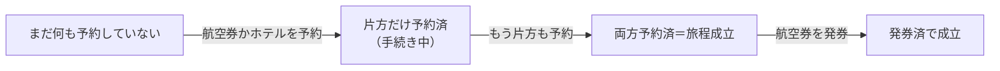

# 旅行予約のケース — 王道（旅程を組む・人数を変える）

旅行予約でよくある本筋のケース。全体の地図・概要・対象外は [`overview.md`](./overview.md)。キャンセルは [`cancel_cases.md`](./cancel_cases.md)、周辺は [`other_business_cases.md`](./other_business_cases.md)、データ整合性は [`data_integrity.md`](./data_integrity.md)。深い仕組み（決済・返金計算・在庫連携）は各モジュールへ譲る。各ケースは観点〈**予約状態・課金/返金・旅程の見え方**〉で示す。

## 旅程を組む（予約・発券）

航空券とホテルを予約して旅程を組む。**2 つは独立に、どちらの順でも予約できる**。両方が予約済になれば旅程成立。航空券はさらに発券して座席を確定できる。

### BK-1. 予約する（片方 → 両方）

- 予約状態: 航空券・ホテルをそれぞれ予約（順不同）。片方だけ＝手続き中、両方＝旅程成立。
- 課金/返金: 予約した分を課金。
- 旅程の見え方: 片方だけなら「手続き中」、両方揃えば「成立」。

### BK-2. 航空券を発券する

- 予約状態: 航空券＝発券済（座席確定）。以降の変更・払戻は発券済の制約下。
- 課金/返金: 発券・座席確定分。
- 旅程の見え方: 発券済で成立。ただしホテルが既にキャンセルなら「発券済なのに宿無し」（→ [`cancel_cases.md`](./cancel_cases.md) CX-4）。

### BK-3. 宿を取る前に航空券を発券した（発券済・ホテル未予約）

- 予約状態: 航空券＝発券済／ホテル＝未予約。
- 課金/返金: 航空券分のみ。
- 旅程の見え方: **回復可能**（まだ宿を取れる）。ホテルを「キャンセル」した CX-4 とは別 ―― 未予約は「これから取る」、キャンセルは「取り消した後」。

## 人数を変える

旅程の人数を変える。状態（航空券 × ホテル）は変えず、人数と課金を動かす（減員で最低を割るときだけキャンセルへ遷移）。効くのは「予約済（生きている）側」。発券前後・各予約の空き・最低人数で効き方が変わる:

| | 航空券が予約済 | 航空券が発券済 |
| --- | --- | --- |
| 増員 | 空き次第で増員 | 座席追加に制約（手数料）。通らなければ保留 |
| 減員 | 最低超なら減員・返金／最低ちょうどはキャンセルへ | 同上＋発券済の払戻制約 |

（手続き中は予約済の側だけ、片方キャンセル済は生き残った側に効く。）

### PS-1. 増員・全対象に空きあり

- 予約状態: 変わらず（人数だけ増）。
- 課金/返金: 差額を課金（発券済の航空券は座席追加に変更手数料）。
- 旅程の見え方: 変わらず成立。

### PS-2. 増員・一部が満席

- 予約状態: 変わらず。一部だけ増やすと全員分の座席が揃わない。
- 課金/返金: **取れた分だけ課金して不足を放置しない**（全体保留 or 取れた分の扱いを決めてから確定）。
- 旅程の見え方: 席数がちぐはぐな未確定状態。

### PS-3. 減員・最低人数を超えている

- 予約状態: 変わらず（人数だけ減）。
- 課金/返金: 差額を返金。
- 旅程の見え方: 変わらず成立。

### PS-4. 減員・最低人数を割る

- 予約状態: 定員下限・最少催行を割る予約は維持できず **キャンセルへ遷移**（→ [`cancel_cases.md`](./cancel_cases.md) の壊れ状態に合流）。減員が状態を動かす唯一のケース。
- 課金/返金: 該当予約は返金（キャンセル扱い）。
- 旅程の見え方: 片方が落ちれば旅程が壊れる。
