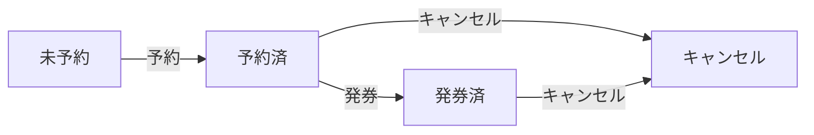

# 旅行予約のケース

旅程（航空券とホテルをまとめて予約し、発券・人数変更・一部/全部キャンセルもできる）で「起こりうること」を、**起きること別の塊**で漏れなく並べる。深い仕組み（決済・返金計算・在庫連携）は各モジュールへ譲る。データ整合性（認可・冪等性・複数予約の独立性）は状態遷移ケースではないので [`data_integrity.md`](./data_integrity.md) に分ける。

## 予約の状態遷移と、旅程の組み合わせ

各予約は状態を遷移する。発券は航空券だけが持ち、発券後は変更・払戻に制約がつく（＝操作の効き方が状態で変わる）。

旅程は航空券とホテル **2 つの予約の組み合わせ**。だから「航空券は発券済なのにホテルはキャンセル」のような食い違いが起こる。**未予約とキャンセルは別**——未予約はまだ取れる、キャンセルは取り消した後。

## 塊の地図

起こりうることを「起きること別」の塊に並べる。各塊は**何で枝分かれするか**だけを示す（中身は各塊）:

- **旅程を組む（予約・発券）** → [`main_cases.md`](./main_cases.md)。未予約 → 予約 → 発券。どこまで進んだか・片方だけ予約の手続き中で枝分かれ。
- **人数を変える** → [`main_cases.md`](./main_cases.md)。増員／減員。発券前後・空き・最低人数で枝分かれ。
- **一部・全部をキャンセルする** → [`cancel_cases.md`](./cancel_cases.md)。どの予約を・発券前後・もう片方の状態で枝分かれ。旅程が壊れるケース。
- **取り違え（周辺）** → [`other_business_cases.md`](./other_business_cases.md)。掛け合わせの外の同一性の誤り。

各ケースは、宣言した観点〈**予約状態（航空券／ホテル）・課金/返金・旅程の見え方**〉で示す（具体値でなく意味的な状態。→ presentation.md「ケースを書く」）。

> 網羅は「航空券の状態 × ホテルの状態 × 操作」の掛け合わせで確かめてある（軸は考える道具で、見出しには出さない）。読み手は各ファイルの分岐が埋まっているかで揃いを確かめられる。

## 対象外（あり得ない／扱わない）

- ホテルに「発券済」は無い（状態集合に存在しない）。
- 両方とも未予約は「まだ何も予約していない」開始状態（ここから「予約」で始まる）。
- すでにキャンセル済の予約への操作（再キャンセルなど）は無効。
