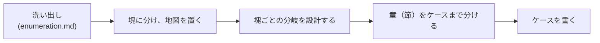

# ケースの表現 — 検算できる形に見せ、塊に分け、ケースを書く

洗い出し（全量を軸で張り、崩して確かめる）は [`enumeration.md`](./enumeration.md)。この文書は、洗い出した網羅を **検算できる形に見せ・塊に分け・ケースに落として書く** 表現方法を扱う。書き上がりの実例は [`example_cases/`](./example_cases/overview.md)。

## 全体思想 — 網羅を、開かず検算できる形で見せる

読み手が **網羅を自分で確かめられる** 形にする。ベタ書きせず、骨格から入って埋まり具合を追わせる。骨格は一本の木に喩えられる:

- **幹＝全体像** — 何と何を掛け合わせているか
- **分岐** — どの条件でどう枝分かれするか
- **葉＝個々のケース** — 分岐の末端。同じ観点で書く

幹・分岐を一目で捉え、葉（ケース）が全部埋まっているかを **数えて確かめられる** ―― これが cases の 2 要件のうち「漏れていないと読み手が確かめられる」の正体で、以降のどのトピックもこの検算可能性のために在る。

（木の喩えはここでイメージを作るためのもの。以降は平文で「全体像・分岐・ケース」と呼ぶ。）

## 表現の組み立て — 流れと用語

洗い出し（[`enumeration.md`](./enumeration.md)）で全量を得たら、表現は次の順で組む:

入れ子: **塊 ⊃ 章 ⊃（節）⊃ ケース**。

- **塊** — 起きること別の分割単位（例「キャンセルする」）。ファイルになる。
- **章** — 塊内のブロック。塊の冒頭で「章への分かれ方」を見せる。
- **節** — 章内の入れ子（必要なときだけ）。
- **ケース** — 分岐の末端の、個々の状況。
- **分岐** — 条件の枝分かれ。この入れ子として、各層の冒頭でその層の割れ方だけ見せる。

（全体像・分岐・ケースを一本の木として捉えるイメージは → 全体思想。）以降、各トピックの思想を示す（書く → レビューの回し方は、これを運用する工程側で定める）。

## 塊に分け、地図を置く

### 思想

洗い出したケースは数が多い。**それを、読み手が「こういう時どうなる?」で引ける単位＝「起きること別」の塊に束ね、入口に地図（overview）を置く** ―― これがこのトピックの仕事。

- 塊の例 — 「予約する」「変更する」「キャンセルする」。読み手は自分の関心（今どの操作の話か）で塊を選べる。
- 塊が育ったら、それぞれをファイルに分ける。overview だけで全体像が掴め、掘りたい塊のファイルだけ開けばいい状態にする。

ファイルの目安:

- `overview` — 全体像＋各塊への地図＋対象外＋導線
- `main_cases` — 王道
- `{テーマ}_cases` — テーマ別（例 `cancel_cases`）
- `other_business_cases` — 周辺
- `data_integrity` — 別扱い（状態遷移でない不変条件）

束ねる単位は **「起きること別」であって、洗い出しに使った軸（掛け合わせ）ではない**。軸はケースを見つける道具で、そのまま見出し・ファイルにすると、具体的なケースが軸の抽象説明に畳まれて消える。軸は表に出さず、各塊の漏れを裏で確かめるのに使うだけ（→ [`enumeration.md`](./enumeration.md)）。

## 塊ごとの分岐を設計する

### 思想

**塊の冒頭に「章への分かれ方」を書く。** そこだけで塊の大筋（章が何で何個に分かれ、どこにケースがどれだけあるか）が掴め、塊の表現力の大半をここで担える。だからケースの細部には降りない。

満たすべきは:

- **焦点は塊 → 章の一段。** 章の中の分岐は、その章の冒頭でさらに書く（同じ入れ子を一段深く）。
- **塊の冒頭だけで、章への分かれ方を掴める。** 条件を散文で説明せず、分かれ方を構造で見せる。
- 掛け合わせの系が複数あるなら、混ぜず分けて見せる。

記法は分岐の形で選ぶ（→ [`expression_notation.md`](../expression_notation.md)）:

- 第一候補 — 補足を子に持つ階層箇条書き（親＝分岐、子＝補足）
- 規則的な対応 — 表
- シンプル／流れ — 素の箇条書き・図（図なら説明を添える）

## 章（節）をケースまで分ける

### 思想

塊冒頭で章への分かれ方を見せたら、各章（必要なら節）を、中身が個々のケース 1 個ずつになるまで分ける。分けきった末端がそのままケース ―― 塊→章と同じ「冒頭で割れ方」を一段ずつ深く繰り返し、最下段でケースに達する。

- 途中で止めて複数ケースを 1 つに丸めない。まだ分けきれていないなら、さらに分岐（or 節）を立てる。
- どのケースも、どこかの末端に載る。載らないなら分け方の漏れ、または「対象外」行き。

## ケースを書く

### 思想

各ケースに書くのは、**その状況で生成されるデータと変わる状態**。状況（軸の値）は全体像・分岐で確定済みだから、ケースでは *結果* だけを書く。**cases はヌケモレを担保する装置**なので gloss せず、このケースで起きることを漏れなく言い切る。

**リード文** — このケースは何か（王道／基準からの立ち位置）。分岐条件の言い換えでも機構説明でもない。

**本体** — 生成データ・変わる状態を、次を掃き出して漏れなく列挙する（掃き出しは *抜け防止の点検* で、出力の固定枠ではない）:

1. **生成・消滅するレコード**（本体＋周辺＋付随）―― 基本。ここを飛ばしがち。
2. **既存データ・各当事者/エンティティの状態変化**。
3. **このケースで成立する付随的な結果**。

該当しないカテゴリは書かない（**数を固定せず・パディングしない**。軽い項目は薄く・豊かは厚く）。

書き方の掟:

- **状態であって処理でない** ―― 「〜された状態」で書く。「後続処理」等の動詞バケツを項目にしない。
- **言い切る（「／」禁止）** ―― この事例の結果を確定させる。「A／B/…」は *分岐の候補値* であってこの事例の状態ではない。
- **他ドメインの都合を書かない** ―― 顧客向け表示（配送ラベル等）は顧客向け API の領分。
- **具体値でなく変化を** ―― 個別の金額・日時・ID は書かない（実行ごとに変わる → 動作確認・`data_models/`）。変化はデルタ式で意味を表す（例 `reserved_stock += 注文数量`）。
- **機構を再掲しない**（モジュールへリンク）・**上流の分岐条件を焼き直さない**（identity は分岐で確定済み）。

**✗ 悪い**（抽象・「／」で候補列挙・処理バケツ・生成が抜け）:

> - 予約状態: 未発券／発券済
> - 課金: 課金／返金
> - 後続処理: 通知・ポイント付与

**✓ 良い**（生成から・言い切り・状態で・漏れなし）:

> - 航空券とホテルの予約レコードが生成される
> - 各予約の料金が課金される
> - 旅程が「両方予約済＝成立」になる
> - ポイントが付与された状態になる
> - 確認通知が送られる

**境界・変種・未確定** は、そのケースに在るときだけ足す。

同種のケース群では、**状態の次元を共通レンズにすると 1 次元を全ケースで縦読みでき、埋まり・食い違いを検算しやすい**（固定枠でなく、触れた次元だけ）。`起きた／影響／対応` のような叙述スロットにはしない。
