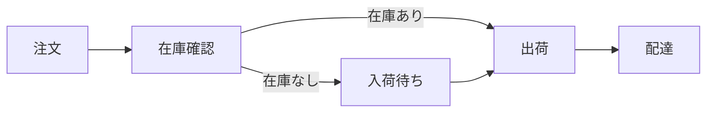
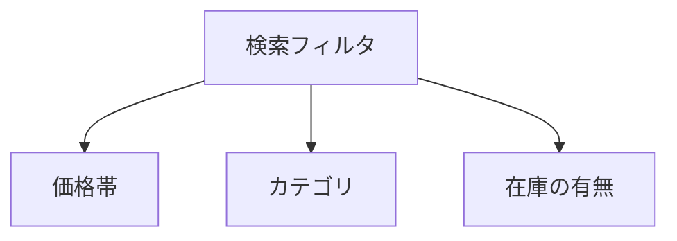
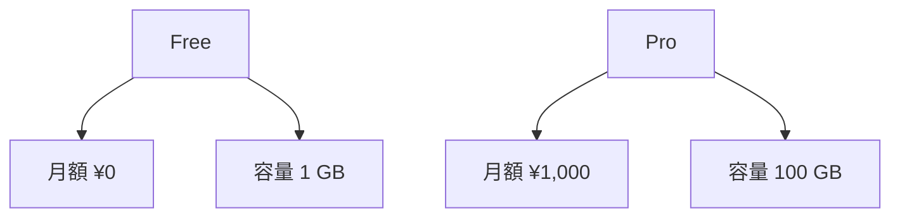
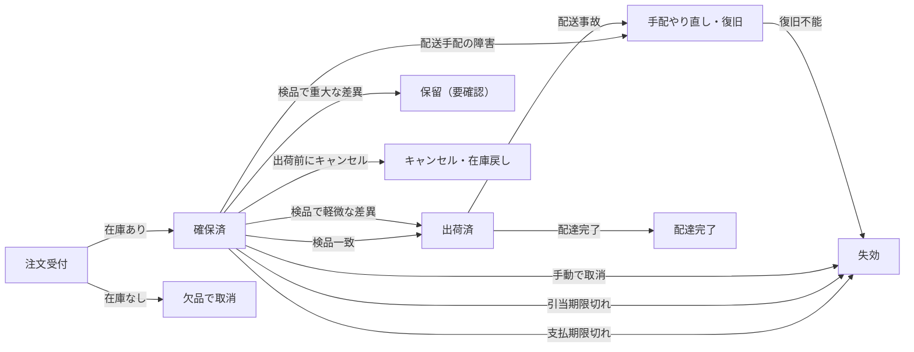
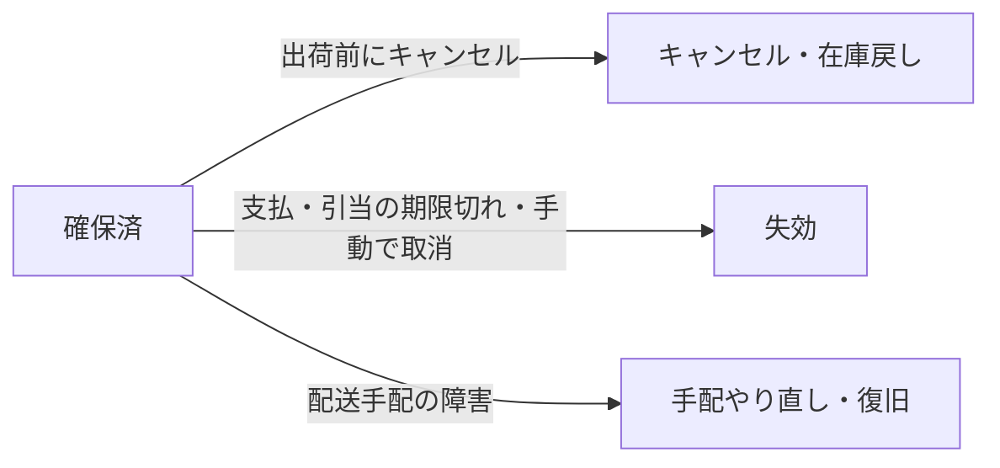

# 表現記法の標準

ある内容を、**図・表・箇条書き・散文のどれで書き表すか**の標準。`documentation_standards/` の傘の下の 1 トピック。構造化の思想（何をどこに置くか）は [`information_structuring`](./information_structuring/README.md) が扱い、こちらは**書き表し方**を扱う。

## 記法は「ピース間の関係の種類」で選ぶ

同じ情報でも、記法を誤ると理解しにくくなる。「網羅している風に見える」「埋めやすい」という**見た目や書きやすさで選ばない**。選ぶ基準はただ一つ——**書こうとしている情報のピースどうしが、どんな関係で結ばれているか**。

| ピース間の関係 | 見分けるリトマス | 記法 |
| --- | --- | --- |
| 描ける構造（流れ・分岐・状態遷移・包含・連結） | 箱と矢印の絵になる | 図 |
| 規則的な交差（行 × 自明で少数の列） | 格子になる | 表 |
| 同格・並列（同じ意味レイヤの兄弟が並ぶ） | 順序を入れ替えても壊れない | 箇条書き |
| 描けない意味（理由・因果・条件・例外・機微・定義） | 言葉でしか結べない | 散文 |

**同じ内容は複数の記法で書けてしまう。** 極論、流れも対応も散文で書ける。だが記法によって**視認性（一目でどれだけ渡せるか）が違い**、上の表は視認性の高い順に並べてある。ここから選び方が決まる:

- **内容の関係に合う中で、最も視認性の高い記法を使う。** 散文は何でも書けるが視認性は最低——構造や対応を安易に散文へ流さない。
- ただし**合致（fit）が順位に優先する**。順位は「その内容が複数記法で書けるとき、どちらへ倒すか」の指針にすぎない。内容の形が変われば適所も変わる。

各記法の節は **効果的 / 他の記法の方が分かりやすいとき / バリエーション** の小見出しで構成する。「他の記法の方が分かりやすいとき」では、その記法に無理に押し込んだ**悪い例**と、適切な記法で書いた**良い例**を現物で並べる。

### 全体目的を、記法に紐付けない

やりがちな最大の事故: 「新概念を説明する」「overview を書く」のような**全体の目的**を、そのまま 1 記法（たいてい散文）に結びつけてしまう。目的は記法カテゴリではなく、**全記法に分解される上位概念**である。「説明する」の中身は、流れ（図）・同格の並び（箇条書き）・理由（散文）に分かれる。目的を 1 記法に紐付けた瞬間、成果物が丸ごとその記法になる（例: overview が全部散文の壁になる）。記法は、目的の**中の各ピースの関係の種類**で選ぶ。

### 読み手を基準に置く

記法選択の目的は、読み手が最短で理解に至ること。とくに**初見・非専門の読み手は「1〜5 分で全体像を掴む」ことを求める**。知らない概念ほど、描ける構造を地の文に埋めず図・箇条書きで見せる。逆に、意味の関係（なぜ）を無理に図にすると自己目的化して重くなる。全部を散文にも、全部を図にもしない。

## 図 — 描ける構造の関係

箱と矢印の絵になる関係——流れ・分岐・状態遷移・包含・連結。文章で読ませると読み手の頭の中で図を再構築させることになり、知らない概念ほど負担が大きい。

### 効果的

分岐のある処理の流れ:



経路も分岐も合流も一目で渡る。

### 弱点

図は**複雑になるほど図自体の読解コストが上がる**。ノード・矢印・分岐が増えると「一目で渡す」という長所が消え、かえって読み解けなくなる。対策は、図に説明（散文・箇条書き）を添えること（下記）と、複雑なら複数の図に分けること（バリエーション）。

### 他の記法の方が分かりやすいとき

#### 箇条書きが向くものを図に

対等な列挙を図にした例:



対等な 3 項目に箱と矢印は過剰で、記号の分だけ読解コストが増える。箇条書きなら:

- 価格帯
- カテゴリ
- 在庫の有無

#### 散文が向くものを図に

理由を図にした例:


矢印が順序でも遷移でもなく、因果を無理に表している。散文なら:

> 在庫確認を出荷前に行うのは、欠品のまま出荷する事故を防ぐためである。

#### 表が向くものを図に

規則的な対応を図にした例:



各項目に属性がぶら下がるだけで、プラン間を縦横に比較できない。表なら:

| プラン | 月額 | 容量 |
| --- | --- | --- |
| Free | ¥0 | 1 GB |
| Pro | ¥1,000 | 100 GB |

### バリエーション

図にすると決めたら、描き方は 2 つ。**まず mermaid を試し、それで無理なときだけアスキーアートに落とす**。

#### mermaid（第一選択）

フローチャート・シーケンス図・状態遷移・ER 図・クラス図など、**箱と線・矢印で表せる構造はほぼ mermaid で書ける**。レンダリングが安定し記法も共通なので、図にするなら基本はこれ。とくにクラス図・シーケンス図のような UML は mermaid でしか綺麗に表せないので、迷わず mermaid。

**図だけで説明しきったつもりにならない。** とくに分岐・状態遷移など**読み解きに頭を使う図には、散文か箇条書きの説明を添える**（何がどの条件で分かれるか、各枝が何を意味するか）。図をぽんと置いて終えるのは、読み手に翻訳を丸投げするぶっきらぼうさ。**例外**は、箇条書きの図示版のような説明不要な単純な図と、シーケンス図・クラス図のようにそれ自体で表現力が完結する図。

#### アスキーアート（mermaid で描けない形のときだけ）

mermaid に無い図形や、レイアウトを手で細かく制御したいときの逃げ道。ただし**「図の中に注釈・補足を書き込みたい」と思ったら赤信号**——それは純粋な「描ける構造」ではなく、注釈の正体はたいてい分岐条件などで、箇条書き（＋散文）の方が読みやすい。たとえば次のアスキーアートは、

```
        在庫あり → 出荷
注文 ──┤
        在庫なし → 入荷待ち → 出荷
```

条件を足すほど手で揃えるのが辛くなる。分岐が主役なら箇条書きで足りる:

- 在庫あり → 出荷
- 在庫なし → 入荷待ち → 出荷

アスキーアートに手が伸びたら、まず箇条書きで代替できないかを疑う。

#### 複雑なら複数の図に分解する

1 枚の図にすべての分岐を詰めると、図自体の読解コストが跳ね上がる（弱点）。そのときは図を割る: **メインの流れを 1 枚、イレギュラーを別の 1 枚**に、あるいは**軸ごとに**（例:「＋方向の処理」と「−方向の処理」を別図に）。メインがある上でのイレギュラーなら、イレギュラー側は多少細かくても許容できる。「全部を 1 枚に」より「読める複数枚」。

たとえば、ある注文の状態遷移を「全部 1 枚」に描くとこうなる（アンチパターン）:



王道（注文受付 → 確保済 → 出荷済 → 配達完了）が、失効・手配やり直し・保留の枝に埋もれて追えない。分けると読める。

**王道の流れ**（まずこれを追う）:


**確保済からのイレギュラー**（王道から外れる枝だけ）:



王道が背骨として先にあるので、イレギュラー側は多少細かくても迷子にならない。「検品」の判定（一致／軽微な差異／重大な差異 → 保留）はさらに枝の中身なので、別の図か表に切り出す。

## 表 — 規則的な交差の関係

行 × 自明かつ少数の列。各行が同じ列を持ち、列の意味が一目で分かるときに引きやすい。

### 効果的

プランごとの対応:

| プラン | 月額 | 容量 | 同時接続 |
| --- | --- | --- | --- |
| Free | ¥0 | 1 GB | 1 |
| Pro | ¥1,000 | 100 GB | 5 |
| Team | ¥5,000 | 1 TB | 50 |

各行が同じ列で揃い、縦にも横にも比較できる。

### 弱点

表は**一マスに置ける情報量が少ない**。カラム数が増える・セルの中身が長くなると、読解コストが飛躍的に上がる（横に追えず、どの列を見ているか見失う）。表は「短い値 × 少数の列」でこそ効く。

### 他の記法の方が分かりやすいとき（セルが長く、列も多いとき）

表が向かないのは、**各セルに 1 文以上の説明が入り、かつ列がいくつもある**とき。短い値なら列が多くても表で追えるが、セルが文になると行の高さが伸び、横に読み通せず、どの列を見ているかも見失う。属性が長文なら、項目ごとの**階層箇条書き**が読める。

セルが長い表:

| プラン | 特徴 | 向いている人 | 注意点 |
| --- | --- | --- | --- |
| Free | 無料で基本機能を試せるが、保存容量と同時接続に厳しい上限がある | まず個人で小さく試したい人 | サポートが無く、障害時は自力で対応する必要がある |
| Pro | 実務に必要な機能がほぼ揃い、上限も実用的な水準まで緩む | 少人数のチームで日常的に使う人 | 監査ログや SSO など統制系の機能は含まれない |

項目ごとの階層箇条書きなら、1 項目ずつ読める:

- **Free**
    - 特徴: 無料で基本機能を試せる。ただし保存容量と同時接続に厳しい上限がある。
    - 向いている人: まず個人で小さく試したい人。
    - 注意点: サポートが無く、障害時は自力で対応する必要がある。
- **Pro**
    - 特徴: 実務に必要な機能がほぼ揃い、上限も実用的な水準まで緩む。
    - 向いている人: 少人数のチームで日常的に使う人。
    - 注意点: 監査ログや SSO など統制系の機能は含まれない。

**セルが 1 文を超えそうで、かつ列が複数あるなら、最初から階層箇条書きにする。** 
逆に、
- 各セルが短い値なら列が多くても表でよい。
- 列数が少ないなら、セルの説明が長くても表で良い。

### バリエーション

表は「**行と列が何を表すか**」で 3 つの形に分かれる。並べたい 2 つの軸の関係で選ぶ。

#### 属性表 — 行＝項目、列＝属性

個々の項目が、それぞれの属性でどんな値を取るかを並べる（上の「効果的」のプラン表がこれ）。項目どうしを縦に、属性どうしを横に見比べられる。最も多い形。

#### 対応・決定表 — 行＝条件、列＝結果

「この条件なら、こうなる」を引く表。条件と結果を漏れなく対応させたいとき（決定表）に効く。

| 在庫 | 対応 |
| --- | --- |
| あり | 出荷 |
| なし | 入荷待ち → 出荷 |

#### マトリクス表 — 行・列がどちらも軸、セル＝交差の値

2 つの軸を縦横に取り、**交差するマス目すべてに意味のある値が入る**とき。星取り表・機能比較・相性表などが典型。

| 機能 ＼ プラン | Free | Pro | Team |
| --- | --- | --- | --- |
| API | ○ | ○ | ○ |
| SSO | × | ○ | ○ |
| 監査ログ | × | × | ○ |

**マス目がまばら、または各行が 1 つの値にしか対応しないなら、マトリクスは向かない。** たとえば状態遷移は、ある状態から次の状態がほぼ 1:1 で決まってマス目の大半が空く——状態遷移図（→ 図）や箇条書きの方が分かりやすい。マトリクスが効くのは、上の星取り表のようにマス目が埋まるとき。

#### 手順表 — 行＝順序のあるステップ

番号付きのステップに、各ステップの属性（操作・期待する結果・補足など）が付くとき。

| # | 操作 | 期待する結果 |
| --- | --- | --- |
| 1 | 管理画面で「新規」を押す | 入力フォームが開く |
| 2 | 必須項目を埋めて保存する | 一覧に 1 件追加される |

**手順は番号付き箇条書きでも表でもよい。** 各ステップが単純な一連の動作なら `1. …` `2. …` の番号リストで足り、ステップごとに複数の属性（操作・結果・補足）が付くなら表にする。

## 箇条書き — 同格・並列の関係

同じ意味レイヤの兄弟が「1 つの枠の下に同じ粒度で並ぶ」とき。

### 効果的

検索フィルタの絞り込み軸——対等で順不同:

- 価格帯
- カテゴリ
- 在庫の有無

### 弱点

箇条書きは**並んでいるものが対等（並列）でないと読解コストが上がる**。しかも書き手は非並列でも「書けてしまう」ため、並列が崩れても——因果や順序が混ざり、表現の金属疲労が起きても——書いている側は気づきにくい。並べたら「本当に同格か」を毎回疑う。

### 他の記法の方が分かりやすいとき

#### 散文が向くものを箇条書きに

関連のない長文を、箇条書きで接着した例:

- 本機能は利便性向上のために導入されたが、初期は一部環境で表示が崩れる不具合があった。
- 料金体系は昨年改定され、現在は 3 プランで提供している。
- サポート窓口は平日のみ対応で、混雑時は返答に数日かかることがある。

3 つは因果も関連もない雑多な長文で、同格・並列ではない。箇条書きを長文の接着剤として無意味に使っているだけ。散文なら（関連がなければ段落や節に分ける）:

> 本機能は利便性向上のために導入された。ただしリリース初期は一部環境で表示が崩れる不具合があった。（料金・サポートは別の話題なので、別の段落や節に分けて書く。）

#### 表が向くものを箇条書きに

規則的な対応を箇条書きにした例:

- Free: ¥0 ／ 1 GB ／ 1 接続
- Pro: ¥1,000 ／ 100 GB ／ 5 接続
- Team: ¥5,000 ／ 1 TB ／ 50 接続

列で揃わず縦の比較ができない（しかも 1 行に「／」で詰め込んでいる）。表なら:

| プラン | 月額 | 容量 | 同時接続 |
| --- | --- | --- | --- |
| Free | ¥0 | 1 GB | 1 |
| Pro | ¥1,000 | 100 GB | 5 |
| Team | ¥5,000 | 1 TB | 50 |

### バリエーション

箇条書きの形は、**各項目がどれだけ説明を背負うか**で決まる。説明が軽い順に下の 3 形があり、重くなったら下へステップアップする（軽いのに大げさな形を使わない、重いのに潰さない）。

#### 散文に挟むフラットな箇条書き

各項目が説明の要らない**素の語だけ**のとき。散文の流れの中に、並列要素やこれから説明するものの頭出しとして差し込む。

> 水は、以下の原子から成る。
>
> - 水素
> - 酸素
>
> この 2 つが結びついた水は、生物の生存に必須である。

#### 階層箇条書き

各項目に**短い説明・補足がぶら下がる**とき。項目を親、説明を子にしてネストする。補足のさらに補足は孫にしてよい。

- 未出荷
    - まだ出荷されていない状態
- 出荷済み
    - 出荷され、まだ配達されていない状態
- 配達済み
    - 出荷され、配達が完了した状態
- 配送不要
    - 注文はあるが、配送する物が無い状態
        - キャンセルやダウンロード販売で送る品が無い場合もこれ

#### 小見出しへ昇格

各項目の説明が育って、箇条書きの入れ子では追えなくなったとき。箇条書きをやめ、各項目を小見出しにして本文で説明する。次のどちらかが出たら昇格を検討する:

- **深さ**: ネストがひ孫（4 階層目）に達した。インデントだけで関係を追うのが限界になる。
- **子孫が独立した話題に育った**: 子が親の一言の補足である域を超え、別レイヤ・別トピックを論じ始めた。たとえば 1・2 が並列で、その下の 1-a・2-b が親の補足から離れて明らかに別の話をしているなら、1・2 はもう「リストの一項目」でなく「節」——各項目を小見出しにして本文で展開する。

そして逆に、**揃えることを昇格の代わりにしない**。箇条書きが要求する並列性は、兄弟どうしの**粒度・レイヤ**が揃っていることであって、各項の内部フォーマット（子項目）まで同じにすることではない。全項目に機械的に同じフィールドを付けにいく（例: どの項にも「崩れ方:」を 1 つずつ）と、揃えること自体が目的化し、本来は昇格すべき豊かな項目まで 1 行に圧縮されて痩せる。**同じリストの兄弟でも、豊かな項目は小見出し＋本文で厚く・軽い項目は箇条書きのまま、と形式が混在してよい。**

## 散文 — 描けない意味の関係（最後の砦・視認性は最も低い）

言葉でしか結べない関係——理由・因果・条件・例外・機微、そして未知を既知に結ぶ定義・喩え（新しい概念を読み手の中に作る仕事）。散文が担うのは意味のつながりであって、構造そのものではない。

### 効果的

理由・条件・機微:

> 在庫確認を出荷前に行うのは、出荷後に欠品が発覚して配送を巻き戻す事態を避けるためである。ただし予約販売では在庫を持たないので確認を省略する。

意味のつながりと例外が、言葉で無理なく結ばれている。

### 弱点

散文は**何でも書けてしまう**が、その裏返しで、**長くなると読解コストが飛躍的に上がる**。構造（流れ・分岐）や対応（規則的な交差）を散文に流し込むと、読み手が頭の中で図や表に組み直す羽目になる＝壁。何でも書けるからこそ、それは他記法が向く内容ではないかを疑う。

### 他の記法の方が分かりやすいとき

#### 図が向くものを散文に

流れを散文の壁にした例:

> 注文を受けたらまず在庫を確認し、在庫があれば出荷し、在庫がなければ入荷を待ってから出荷する。出荷したものは配達される。

分岐と合流が地の文に埋もれ、一目性が無い。図なら:


#### 箇条書きが向くものを散文に

対等な並列を文に埋めた例:

> 検索では、価格帯・カテゴリ・在庫の有無・送料無料か・レビュー評価・発送元地域・セール中かで絞り込める。

対等な絞り込み軸が文に埋もれ、いくつあるか数えられず、見比べもできない。箇条書きなら:

- 価格帯
- カテゴリ
- 在庫の有無
- 送料無料か
- レビュー評価
- 発送元地域
- セール中か

#### 表が向くものを散文に

規則的な対応を文にした例:

> Free は月額 0 円で容量 1 GB・1 接続、Pro は月額 1,000 円で 100 GB・5 接続、Team は月額 5,000 円で 1 TB・50 接続である。

プラン間の比較が全くできない。表なら:

| プラン | 月額 | 容量 | 同時接続 |
| --- | --- | --- | --- |
| Free | ¥0 | 1 GB | 1 |
| Pro | ¥1,000 | 100 GB | 5 |
| Team | ¥5,000 | 1 TB | 50 |

## 表現記法 tips

- **「分かりにくい」の指摘は、記法選択のミスを疑う。** 記法はそのままに内容だけを微修正しない。一段メタに引いて「伝えたいことを表しているのがこの記法か」まで問う。分かりにくさの多くは、文言でなく記法の選び方に原因がある。
- **複雑なものを 1 記法に押し込まない。** 1 つの塊に複数の関係の種類が混ざるなら、記法をまたいで分割する（2 つの図に分ける／散文と箇条書きに分ける、など）。無理に一枚の図・一連の散文にまとめようとしない。
- **太字で見出しを代用しない。** 段落の頭に `**まとめ:**` `**思想:**` のような太字ラベルを置いて節の切れ目にするのはアンチパターン。見出しには見出し記法（`##`〜）を使い、太字は文中の語の強調に留める。見出し記法なら階層・目次・アンカーが機能して読み手が構造を掴めるが、太字ラベルはそのどれも与えず、見出しのつもりが本文に埋もれる。
- **記法をまたいで分割したら、同じ対象を指す語を揃える。**
  1 つの塊を表と散文へ分けたとき、記法ごとに違う語で同じ対象を呼ぶと、読み手はそれらを別物として読む。
  片方だけを根拠にした解釈が成立し、書き手は矛盾に気づかない。
  語を統一するか、統一できないなら「これは同じものを指す」と本文で結ぶ。
    - やってしまいがちな失敗: 表の列で「対応する修正」と書き、同じ対象を本文では「一般則」とだけ呼ぶ。本文だけを読んだ人は、修正内容ではなく抽象的な規則文が合意対象だと解釈する。
    - 別ドメインの例: API ドキュメントで、表のカラム名を `retry_count`、本文の説明を「再試行の上限」と書き分ける。読み手は上限値と実行回数を別々のフィールドとして探す。

#### 散文で書けるものを1行散文に
散文が向くと判断したので無思考で散文にした例:

> **レビューの向き合い方（共通）**: レビューは、その成果物の**読者になりきって「この人が理解できるか」だけを見る**。読者が具体的に誰かは各工程で定義する（overview の読者は [`core_readers.md`](./core_readers.md) の「概観読者」）。**各観点はこの一点「読者が理解できるか」の言い換えにすぎず**、観点リストを消化するのが目的ではない。だから観点は、思いつきの例を固定リスト化したものでなく、「この読者が理解に至るには何が要るか」から毎回ゼロベースで導く。

散文であっても1行100字を超えたら、基本句点、1文が長過ぎたら読点で改行を行う。

```
**レビューの向き合い方（共通）**: 
レビューは、その成果物の**読者になりきって「この人が理解できるか」だけを見る**。
読者が具体的に誰かは各工程で定義する（overview の読者は 「概観読者」）。
**各観点はこの一点「読者が理解できるか」の言い換えにすぎず**、観点リストを消化するのが目的ではない。

だから観点は、思いつきの例を固定リスト化したものでなく、「この読者が理解に至るには何が要るか」から毎回ゼロベースで導く。
```
改行した結果部分的に散文以外の表現記法が向くと判断したら再帰的に別の表現記法が向くかどうか検討。
（「／」が多用される表現を見受けられたら、「散文に挟むフラットな箇条書き」などを検討）
