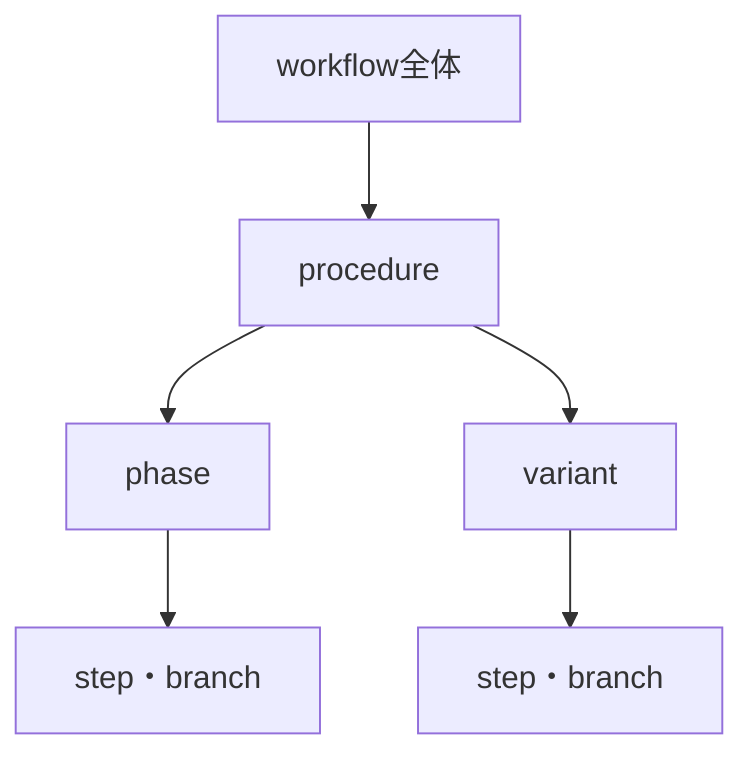
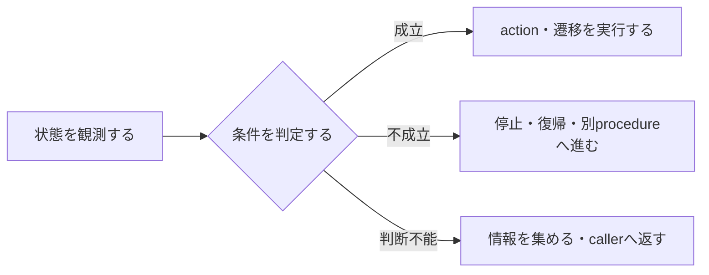
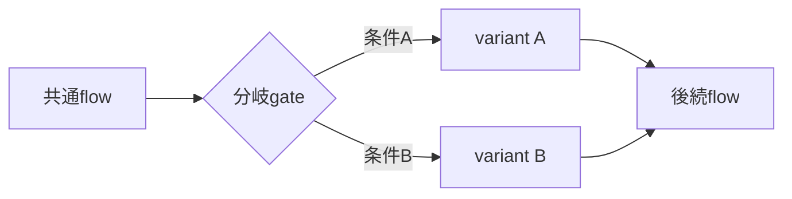
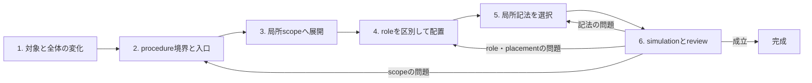

# workflow記述の書き方

workflowは独立した文書種別ではない。skill、runbook、README、標準などの一部または全体に含まれる、読み手が判断とactionを順に実行して状態を変える記述である。

この標準は完成形を模写するtemplateを定めない。情報の所有範囲を決める`scope`と、そのscope内で情報の働きを区別する`semantic role`の二軸から、procedureの境界、実行順、gate、階層、表現記法を導く。

## 対象と目的

成果物の名前やfile単位ではなく、記述の働きで対象を判定する。次の要素を組み合わせ、開始状態から完了状態へ読者を導く記述がworkflowである。

- 実行前に成立している開始状態
- 実行可否や行き先を変える判断
- 状態を変える順序付きaction
- 条件による分岐または別procedureへの遷移
- procedureやworkflowを抜けてよい完了状態

一つのfile全体がworkflowである場合も、長いskillの一sectionだけがworkflowである場合も対象になる。単なるrule一覧、概念説明、順不同のchecklistは、それだけではworkflowではない。ただし、procedureを選ぶ条件や実行中の不変条件として使われるなら、workflowの該当scopeに含まれる。

目指すのは、読み手が次を自力で復元しなくても実行できる状態である。

- 何を達成し、自分はどのprocedureから入るのか
- どの順序で状態が変わり、どこで判断・分岐・停止するのか
- 何が成立したらprocedureまたはworkflowを抜けてよいのか
- 各判断やactionに、どの意図、契約、gateが効いているのか

情報一般の配置と理解の階層は[`information_structuring.md`](./information_structuring.md)、図・表・箇条書き・散文の選択は[`expression_notation.md`](./expression_notation.md)、必要な説明の深さは[`core_readers.md`](./core_readers.md)が扱う。この標準は、それらをworkflowへ当てはめるときのprocedure境界、実行順、進行制御、状態遷移を扱う。

## 全体から局所へscopeを下る

workflowの構造は、読み手が辿るscopeを主軸にする。

この図は固定outlineではない。単純なprocedureへ空のphaseやvariantを作らず、実在する深さだけを使う。variantの内部に複数の中間状態があるなら、variantの下へphaseを置いてよい。

情報は、意味を欠かずに置ける最も狭いscopeへ置く。

- 狭すぎると、同じ意図やruleが複製され、適用範囲が分裂する。
- 広すぎると、関係のないprocedureまで縛り、局所条件から意味を切り離す。
- 同時に読まなければ判断できない情報は、役割が異なっても同じ局所scopeに保つ。

`scope × semantic role`の全組合せ表は作らない。すべてのroleがすべてのscopeに必須であるかのような空欄を生み、内容ではなくtemplateが構造を支配するためである。

## 各scope内で情報の働きを区別する

semantic roleは、各scope内の情報を見分けるための語彙である。role別に素材をworkflowのtop-levelへ集めるための分類ではなく、同じ文へ異なる働きを潰していないか、必要な情報がactionから分散していないかを判断するために使う。

| role | 答える問い | placementの基準 |
| --- | --- | --- |
| 目的 | このscopeは何のために存在するか | 対象scopeの入口 |
| 成果・完了状態 | 何が成立すれば抜けてよいか | 対象scopeの出口判断 |
| 設計意図 | なぜこの境界・順序・分岐なのか | 理由が効くscope内 |
| 不変条件・契約 | 実行中に何を壊してはいけないか | 全対象actionを覆う最小scope |
| gate | 入る・進む・分岐する・抜ける条件は何か | 制御対象より前 |
| action・状態遷移 | 何を行い、状態がどう変わるか | 実行順の位置 |
| validation | 条件や結果を何で確認するか | 対象gate・action・成果の近く |
| アンチパターン | どの誤判断・誤操作を防ぐか | 失敗が生じるscope |

この表はroleの地図であり、成果物へ同名の見出しを要求しない。以下では、roleごとの意味と共通する判断基準を説明する。各scopeでの具体的なplacementは後続sectionで扱う。

### 目的と成果・完了状態

`目的`は、そのscopeが何を成立させるために存在するかを示す。`成果・完了状態`は、その目的が達成され、scopeを抜けてよいと外から確認できる状態を示す。

最後のactionを実行した事実と、成果が成立したことは同じではない。たとえばartifactを送信したことが最後のactionでも、受信側で利用可能になったことが完了条件なら、送信だけでprocedureを完了させない。

目的と成果はworkflow全体だけでなく、procedureやphaseにも存在しうる。ただし、親の目的を言い換えるだけなら繰り返さない。そのscopeを選ぶ、抜ける、再実行する判断に必要な場合だけ書く。

### 設計意図

設計意図は、なぜそのscope境界、順序、分岐、actionを選び、それによってどの失敗を防ぐかを説明する。目的が「何を成立させるか」に答えるのに対し、設計意図は「なぜこの形で成立させるか」に答える。

全体構造の理由はworkflow全体、procedureを分けた理由はprocedure、特定variantだけの理由はvariant、局所actionの理由はstepへ置く。手順ではないという理由でactionから遠ざけず、局所情報だという理由でactionと一文へ圧縮もしない。同じscope内で、理由と実行内容を構造的に区別する。

### 不変条件・契約

不変条件・契約は、一連のaction中に継続して成立させるruleである。特定時点の実行可否を決めるgateとは異なり、scope内の複数actionを通して守る。

効く全actionを覆える最小の共通scopeへ一度だけ置く。特定variantだけのruleをworkflow全体へ引き上げると無関係なflowを縛る。全procedureへ効くruleを各stepへ複製すると、更新時に契約が分裂する。

### gate

gateは、workflow、procedure、phase、step、branchへ入る、進む、分岐する、または抜ける可否を決める条件である。gateが制御するのはactionだけではなく、scope間の遷移も含む。

| gate | 制御するもの | 置く位置 |
| --- | --- | --- |
| 入口gate | workflow・procedure・phaseへ入る可否 | 対象scopeの詳細より前 |
| 進行gate | 次のphase・stepへ進む可否 | 制御する遷移より前 |
| 分岐gate | variant・branchの選択 | 各枝へ分かれる直前 |
| 完了gate | procedure・workflowを抜ける可否 | 成果のvalidation後 |

gateの基本flowは次のようになる。

gateを明示するときは、次を特定する。

- 何を観測するか
- どの条件なら成立・不成立か
- 条件ごとにどのaction、branch、procedureへ進むか
- 判断できない場合に停止するか、情報収集へ戻るか

すべてのstepへ機械的にgateを付けない。誤って進むと履歴や成果物を壊す、複数の行き先から選ぶ、情報不足なら止まる、以前の状態で実行可否が変わる、といった場所で明示する。

### action・状態遷移

actionは実際に状態を変える操作である。stepは、一つのactionと、そのaction後に成立する状態を核にする。一つの番号へ独立して失敗しうる複数の状態遷移を詰めると、途中で止まったときにどこまで完了したか判定できない。

番号付き手順へ置くのは、順序を入れ替えると結果が変わるactionである。順序を入れ替えても壊れない項目は、同格のruleや観点を手順に見せている可能性がある。

### validation・アンチパターン

validationは、gateの条件やaction後の状態、完了状態が成立したかを観測する方法である。対象から離れた検証章へ一律に集めず、その観測結果が制御するgateやactionの近くへ置く。複数procedureで同じ検証契約を使う場合だけ、共通scopeへ引き上げる。

アンチパターンは必須fieldではない。全体構造を誤らせるものはreview観点、procedureの誤選択は入口gate、stepの誤操作はactionとvalidationの近くへ置く。失敗を防ぐ効果がない場所へ、他sectionとの対称性だけで追加しない。

## workflow全体を書く

workflowの入口には、どのprocedureを選ぶ読者にも共通して必要な情報だけを置く。候補は次のとおりだが、実在しないもののために見出しや空欄を作らない。

- **全体の目的と成果**
  - 開始前と完了後で何が変わるかを示す。`処理する`のような行為名だけでなく、何を成立させるかを書く。
- **全体の設計意図**
  - workflow全体の境界、procedure構成、順序をその形にした理由だけを扱う。個別actionの理由は置かない。
- **全procedureへ通底する不変条件**
  - どの入口から実行しても守る契約に限る。局所ruleを全体化しない。
- **procedureの地図と入口・完了gate**
  - 開始状態からどのprocedureへ入るか、procedure同士がどう遷移するか、workflow全体をいつ抜けるかを示す。

procedure間の流れや分岐が描けるなら図、開始状態と入口が規則的に対応するなら決定表を使う。冒頭へ全procedureの詳細を要約せず、読者が自分の入口を選ぶための地図に留める。

## procedureを書く

全体の入口から先はprocedureが主役になる。一つの長い番号列を先に作らず、開始状態と成果から境界を導く。

| 観測した違い | 第一候補 | 判断理由 |
| --- | --- | --- |
| 開始状態・triggerが異なる | 別procedure | 入口判断が異なる |
| 主たる成果・完了状態が異なる | 別procedure | 抜ける基準が異なる |
| 失敗時・完了後の遷移先が異なる | 別procedure | lifecycleが異なる |
| 再実行したときの意味が異なる | 別procedure | 同じ手順として再開できない |
| 開始状態と成果は同じで途中だけ異なる | variant | 共通flowを一度だけ持てる |

表の条件は機械的な採点項目ではない。複数行にまたがる場合や、途中の差がprocedureの目的まで変える場合は、開始状態から完了状態までsimulationして境界を決める。

procedureの見出しは、読み手が何を行うまとまりか判別できる名前にする。配下には開始条件から完了状態までの実行順を置き、次の情報は必要なものだけをprocedure内に保つ。

- procedure固有の目的と成果
- procedureを独立させた設計意図
- 入口・進行・完了gate
- procedure内の全actionへ効く不変条件
- 失敗、再実行、完了後の遷移先

procedureを抜ける基準は、最後のstepを実行した事実ではなく、その結果として成立する状態で定める。成果が成立しなければ、停止、前段への復帰、別procedureへの遷移のいずれかを示す。

## phase・variantを書く

一つのprocedureが複数の意味ある中間状態を経るなら、stepをphaseへまとめる。phaseは見た目上の区切りではなく、配下のstepによって一つの中間状態を成立させるまとまりである。`準備`や`処理`のような万能語より、抜けたときの状態が分かる名前を使う。

条件でflowが変わる場合は、共通部分の後に分岐gateを置き、variantを分ける。

何を観測し、どの条件で、どの枝へ進むかを分岐前に示す。判断できない場合がありうるなら、推測して進まず、停止、情報収集への復帰、callerへの返却など遷移先を決める。

phaseやvariant固有の目的、意図、rule、validation、アンチパターンは、そのscope内に保つ。例外flowだけの制約をprocedure全体へ引き上げたり、通常flow、例外flow、procedure全体の補足を同じ階層へ並べたりしない。

## step・branchを書く

stepの核はactionとaction後の状態である。次の情報は、必要になった場合だけ同じ局所scopeへ隣接させる。

- 誤実行の余地があるなら、actionより前のgate
- 結果を外から確認しにくいなら、期待する状態とvalidation
- 局所の順序や操作を選んだ理由が判断へ影響するなら、設計意図
- そのstepでだけ守るruleや防ぐべき誤操作があるなら、不変条件またはアンチパターン
- 失敗後に続行してはいけないなら、停止条件と戻り先

roleが違うという理由だけで別の章へ分散させず、同時に読める位置で見出し、段落、補足を使って区別する。すべてのstepへ`前提`、`判断`、`理由`、`失敗時`という固定fieldを付けない。

stepの説明が複数の下位actionや判断へ育ったら、箇条書きを深くする前にphaseまたはsubprocedureへ昇格できないか検討する。branchが複数条件と複数結果の規則的な対応を持つなら決定表、状態が分岐・合流するなら図を使う。

## workflow記述を組み立てる手順

Markdownの外形より先にscopeとprocedureを決め、その後で各scope内のroleと記法を決める。

図は全体の順序と戻り先を示す。各phaseで何を判断するかは次の手順で説明する。

### 1. 対象と全体の変化を確定する

workflowとして扱う記述の範囲を決め、開始前の状態と完了後に成立させる状態を書く。複数の成果が互いに独立して完了しうるなら、一つのworkflowやprocedureへ束ねない。

誰がどの深さまで単独で実行できる必要があるかも確認する。必要な説明量は[`core_readers.md`](./core_readers.md)の読者像で測る。

### 2. procedureの境界と入口を導く

開始状態、trigger、成果、再実行の意味、遷移先を比較し、独立procedureの候補を切り出す。各候補へ入口gateと完了状態を仮置きし、同じ開始状態と成果を持つ途中差分だけのflowはvariantへ戻す。

procedure候補が揃ったら、読者がどの入口を選ぶかとprocedure間の遷移を先に確かめる。入口を説明できないまま詳細stepを書き始めない。

### 3. 各procedureを局所scopeへ展開する

procedureごとに開始状態から完了状態までをsimulationする。意味ある中間状態があればphase、条件でflowが変わればvariantまたはbranch、実際に状態を変える単位をstepとして組む。

兄弟要素について、同じ親の下にいる理由と同じ意味levelである理由を説明できなければ、procedure境界または階層へ戻る。

### 4. 各scope内でsemantic roleを区別する

全体、procedure、phase、variant、stepの順に、目的、成果、設計意図、不変条件、gate、action、validation、アンチパターンのうち実在するものを置く。

role別の箱へ移動せず、対象actionや判断と一緒に読める文脈を保つ。異なるroleを一文へ潰していれば構造的に区別し、同じruleが複数scopeへ重複していれば適用範囲を見直す。

### 5. sectionごとに局所記法を選ぶ

各sectionのpiece間関係を、描ける構造、規則的な交差、同格・並列、描けない意味へ分解する。その関係に合う中で最も視認性の高い記法を[`expression_notation.md`](./expression_notation.md)から選ぶ。

隣接sectionの見た目へ揃えず、図・表・箇条書き・散文をsectionごとに再判定する。一つの塊に複数の関係があれば、記法をまたいで分ける。

### 6. 状態遷移をsimulationしてreviewする

異なる開始状態の読者として、入口から完了または正しい停止まで辿る。欠けた前提、判断、遷移先は該当scopeへ補う。問題がscope、role・placement、記法のどこにあるかを診断し、図の戻り先へ戻る。

## 構造と表現をreviewする

reviewでは、情報が存在するかだけでなく、読み手の実行順、scope、semantic role、piece間関係に沿って表現されているかを見る。

- **見出しだけを読む**
  - workflowの入口、procedure、phase、variantの関係が見えるか。全体情報とprocedure、通常flowと例外flow、actionと補足が同じlevelに並んでいないかを見る。
- **番号を入れ替える**
  - 入替えても結果が変わらないstepは、本当に手順かを疑う。反対に、順序依存のactionが複数sectionへ散っていないかも確認する。
- **状態を一つずつ動かす**
  - 各actionの前提、action後の状態、次の遷移先を追う。判断不能、失敗、再実行、再開の経路が宙に浮く地点ではgateかprocedure境界が不足している。
- **scopeの漏れとroleの混同を探す**
  - 局所意図やruleが上位へ一般化されていないか、横断ruleがstepごとに複製されていないか、目的・理由・action・完了条件を同じ文で代用していないかを見る。
- **記法を逆向きに検査する**
  - 図は本当に箱と矢印になる関係か、表は短く規則的な交差か、箇条書きは同格か、散文に描ける構造や規則的対応を埋めていないかを確認する。
- **外形の対称性をsmellとして扱う**
  - 意味の異なるsectionが、理由なく同じ小見出し、同じ箇条書き数、同じ文型を持つならtemplateへ流し込んだ疑いがある。同じsemantic roleを持つcaseやvariantを比較する場合だけ、同じformatに意味がある。

問題を見つけたら文言だけを整えない。入口が選べないならworkflow全体またはprocedure境界、局所ruleの意味が失われているならscopeとplacement、情報関係を頭の中で組み直す必要があるなら表現記法へ戻る。review項目を一律の合格欄として埋めること自体を目的にしない。
