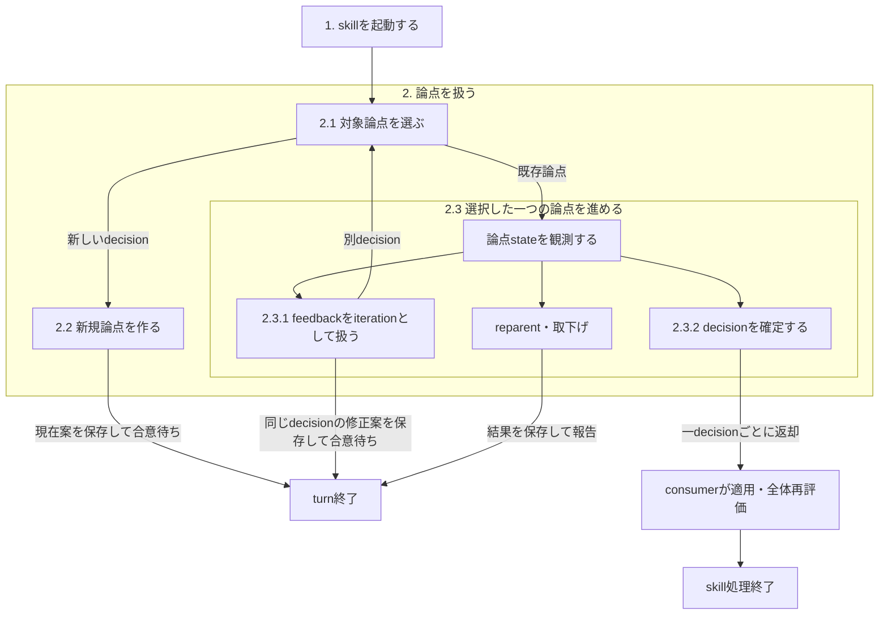

# Facilitate Discussion

## 目的と成果

明示された議論を一つのdecision単位で進行し、その時点の完全な合意対象、feedbackによる変遷、決定を一つのdiscussion fileへ保存する。fileだけを読む人が、sessionの発言を補わずに現在案を評価できる状態を作る。

成果は次の二つである。

- 更新されたdiscussion file
- chat上で合意された決定と具体的なネクストアクション

consumer向けの固定result schemaは設けない。一つの論点でdecisionを確定するたびに、決定後の成果物更新や後続workflowをconsumerへ返す。複数論点のdecisionをまとめてから返さない。

## 起動gate

次のいずれかに該当するときだけ適用する。

1. ユーザーが `$facilitate-discussion` を明示した。
2. ユーザーが議論をMarkdownへ継続記録するよう明示した。
3. `task-design`、`steering`、`design-consult` 等のconsumer skillが、保存を伴う議論workflowとして明示適用した。

通常の質問、説明、短い相談から暗黙起動してはならない。

## 責務境界

### このskillが所有するもの

- discussion fileの解決、作成、継続利用
- 論点の開始、提案、検証、feedback routing、決定
- 合意対象のself-containedな保存
- 議論履歴と現在状態の更新
- 論点採番と親子validation

### consumerが所有するもの

- 議論の起動条件
- 議論対象とconsumer固有制約のcontext
- discussion directoryの用意
- 一つの論点ごとに返されたdecisionの適用先、適用方法、適用後の再評価と後続workflow

consumerの適用先を `design.md` や `tasklist.md` に固定しない。

## 入力

明示設定は次の二つだけとする。

| 設定 | 意味 |
| --- | --- |
| `discussion_directory` | discussion fileを置く既存directory |
| `discussion_file_name` | 任意。pathを含まないbasename。defaultは `discussion.md` |

議論対象とconsumer固有制約は、現在の会話またはcallerから渡された自然言語contextとして受け取る。

`open`、`iterate`、`decide`、`reopen`、`topic_id`、`親論点`、`起点となった原文`は入力fieldではない。外部event、会話、discussion fileの現在状態から、このskillがentry procedureを選び管理する内部状態である。

## 全体の設計意図

- **discussion fileをsession外の正本にする**
  - 合意確認より前に完全な現在案を保存し、chatにしか判断対象が残らない状態を防ぐ。
- **一つのleaf論点を一つのdecisionに限定する**
  - feedbackごとにdecision scopeを再判定し、独立decisionを一つのiterationへ混ぜない。
- **履歴と現在stateを両立する**
  - 過去iteration、旧決定、却下理由を不変にし、現在の合意対象、status、決定、ネクストアクションだけを局所更新する。
- **discussion processとdomain固有workflowを分ける**
  - このskillは議論の記録と決定までを所有し、一つの論点を決定するたびに適用をconsumerへ返す。consumerが適用と再評価を終える前に、次の論点を続けない。

## workflow全体で守る不変条件

- discussion fileをsession外の正本とする。書込み直前にfile全体を再読込し、同じfileへの書込みはsingle writerで行う。
- canonicalな `## 論点N:` とlegacyな `### 論点N:` を走査する。同じ番号が複数存在すれば全書込みを停止してユーザーへ報告し、自動修復、renumber、欠番再利用を行わない。
- 過去iteration、旧決定、却下理由を変更・削除しない。既存h1、論点順序、legacy formatも一括変更しない。
- ユーザーへ合意を求める前に、初見の読者が単独で評価できるself-containedな完全案と具体的な判断対象をdiscussion fileへ保存する。
- chatではdiscussion file名、論点番号、提案番号または見出し、判断対象を特定する。`これ`、`上記`、`大枠`のようにsessionだけで解釈する指示語で合意を求めない。

## 実行workflow

skill起動は一回だけ通る初期phaseである。起動後は論点levelへ進み、一つの論点を扱っている間だけ、その配下のiteration levelへ入る。iterationの判定で別decisionだと分かった場合は、skill起動へ戻らず、一段上の論点選択へ戻る。

図のsubgraphはscopeの包含を表す。skill起動、論点選択、iterationを無前提な兄弟分岐として扱わない。consumerによる適用・全体再評価はこのskillの外側にあり、その後に必要なら更新済みcontextで再適用される。

### 1. skillを起動する

ユーザーまたはconsumerがskillを明示適用し、discussion fileがまだ確定していないときに一度だけ入る。起動後のfeedbackごとにこのphaseを再実行しない。

#### discussion fileを解決する

1. `discussion_directory`が渡されていれば使う。未指定なら、議論を始める前に具体的なdirectory pathをユーザーへ確認する。
2. directoryが存在することを確認する。存在しなければ推測作成せず、consumerまたはユーザーへ用意・再指定を求める。
3. `discussion_file_name`がなければ`discussion.md`を使う。絶対path、`../`、`/`、`\`等のpath separatorを含む指定は拒否し、basenameを求める。
4. fileの有無によって起動variantを選ぶ。

| 起動variant | action |
| --- | --- |
| fileが存在しない | 先頭に`# 議論記録`を持つfileを新規作成する |
| fileが存在する | 全内容を保持して継続利用する。h1の追加・置換や旧formatの一括整形は行わない |

5. file全体を読み、現在のdiscussion目的、既存論点、status、決定、現在の合意対象、`親論点`、未決child、論点番号を把握する。
6. 論点番号の重複がないことを確認する。重複していれば書込みを停止し、自動修復しない。

#### 起動phaseの完了gate

target directory、discussion file、現在のdiscussion stateを一意に解決できた場合だけ論点levelへ進む。file解決だけを依頼された場合は、新規論点を作らずここでworkflowを終えてよい。

### 2. 論点を扱う

discussion fileが解決済みで、議論するdecision候補、既存論点へのfeedback、または保存済み提案への合意が到着したときに入る。ここでは一つのleaf論点を一つのdecisionとして選び、その論点が次のユーザー判断を待てる状態または終了状態になるまで扱う。

#### 論点levelで守る契約

新しいdecision候補またはfeedbackを扱うときは、次を最初に問う。

> このdecisionの結論が変わると、現在のdiscussion目的または指定parentの決定・実装範囲が変わるか。

- 変わる場合だけdiscussion scope内として論点選択へ進む。
- 変わらなければactiveな論点を作らない。consumer内部の判断またはscope外候補としてchatで区別する。
- 影響が不明ならactiveな決定論点を作らず、必要な事実と調査候補を示す。ユーザーがdiscussion scopeへ含めた場合だけ論点化する。

`独立論点` は現在のdiscussion目的には属するが、同じfile内の他論点へ直接依存しないdecisionだけを指す。discussion目的と無関係な事項の受け皿にしない。

親子関係の正本はchild entryの任意field `親論点`だけとする。parent側へ`子論点`fieldを保存せず、child側の参照から一覧を導出する。親を保存・変更する前に、次をすべて確認する。

- 直接の親は最大一つ
- 親は同じdiscussion file内に存在する
- 自己参照ではない
- 親参照を辿っても循環しない

親番号と子番号の大小は制約しない。別fileの論点は親にせず、本文からfile pathと論点番号で参照する。parent自身にも分解内容の実質的なdecisionを残す。未決childがあればparentを`子論点待ち`、全childが決定済みなら`分解済み`とする。未決child集合が変わったときだけparent statusを同期する。

#### 2.1 対象論点を選ぶ

到着したeventとfileの現在stateを比較し、どの論点を扱うかを決める。この判定がiterationより上位にあるため、iteration中に別decisionを検出した場合はここへ戻る。

| 観測した関係・state | 次に行うこと |
| --- | --- |
| activeな既存論点と同じdecisionの原因・提案・検証を変える | その論点を選び、`2.3.1 feedbackをiterationとして扱う`へ進む |
| 決定済みの既存論点と同じdecisionを変える | その論点を選び、`決定済み論点を再開するvariant`へ進む |
| 既存decisionに依存する下位decision | childとして新規論点を作る |
| 共通parentに属する別decision | siblingとして新規論点を作る |
| 複数の既存論点を規定する上位decision | 後発parentを新規作成し、必要な論点をreparentする |
| discussion目的に属し、他論点へ直接依存しないdecision | 独立論点として新規作成する |
| 保存済みの現在案への合意 | 対象論点を選び、decisionを確定する |
| 作成済み論点がdiscussion scope外と判明した | 対象論点を選び、取下げる |

#### 2.2 新規論点を作るvariant

`2.1`で新しいdecisionと判定した場合だけ入る。新規entryには`templates/discussion_entry.md`を使い、template全文を`SKILL.md`へ複製しない。

1. fileを再読込し、canonical h2とlegacy h3の最大番号を再計算する。新しい番号は最大値+1とし、既存論点がなければ`論点1`とする。
2. 表面の質問ではなく、質問が生まれた設計上の問題を`提起の背景`へ書く。
3. 具体的な事象から原因を追跡し、`根本原因0 + 提案0`へ完全な現在案、`現在の合意対象`へ同じentry内の提案参照と今回のdecision・影響範囲、検証へ提案の弱点を書く。iterationの入口gateから別decisionとして戻った場合は、`論点routingの判断`へdiscussion scopeに属する理由と、選択中だった論点とは別decisionである理由も保存する。
4. childまたは後発parentを作る場合は、論点levelの親子契約を検証する。
5. canonicalな`## 論点N: タイトル`としてfile末尾へ追加する。childを追加した場合だけparent statusを同期する。
6. 保存後にdiscussion file名、論点番号、提案番号または見出し、判断対象をchatで具体的に示し、合意を求める。

review起点の最上位論点では、ユーザーの言葉を`起点となった原文`へ変更せず保存する。独立したfeedback ledgerや`FB-N`を作らない。一つのfeedbackから複数decisionが生じる場合は、原文と分解自体の実質的なdecisionを持つparentを作り、leafごとにchildへ分ける。複数feedbackが一つのdecisionへ収束する場合は、一つの論点内に複数の原文を保持できる。

新しい一decisionの完全な現在案がactiveな論点として保存され、具体的な合意確認をchatへ返した時点で、このvariantを抜ける。

#### 2.3 選択した一つの論点を進める

`2.1`で既存論点を選んだ後に入る。論点の現在stateと到着したeventに応じて、このscope内の処理を選ぶ。

##### 2.3.1 feedbackをiterationとして扱う

`2.1`でactiveな既存論点を選び、その論点へのfeedbackを処理するときだけ入る。feedbackを受けた時は、iterationを追加する前に必ずこの分類をやり直す。

###### iterationの入口gate

| feedbackの判定 | 遷移 |
| --- | --- |
| 選択中のactive論点と同じdecisionの原因・提案・検証を変える | 同じ論点へiterationを追記する |
| child・sibling・後発parent・独立論点にあたる別decision | iterationを追加せず、一段上の`2.1 対象論点を選ぶ`へ戻る |
| 選択中の論点が決定済みで、同じdecisionを変更する | `決定済み論点を再開するvariant`へ進む |
| 作成済み論点自体がdiscussion scope外と判明した | iterationを追加せず、`scope外の既存論点を取り下げる`へ進む |
| discussion目的へ影響しない別事項 | activeな論点を作らず、chatでscope外と示す |

このgateはiterationの所属先を決める。skill起動済みという前提やtarget fileの解決を毎回分岐させない。

###### 同じdecisionへiterationを追記する

1. feedbackを受けた時点の事象と検証結果を保存する。
2. `論点routingの判断`に、現在のdiscussion scopeへ属する理由と、同じdecision scopeとしてiterationを継続する理由を書く。
3. 原因または提案のどのlevelへ戻るかを書く。
4. `変更点`へ前案との差分を書く。
5. `提案N（現時点）`へ差分ではなく修正後の完全な現在案を書く。
6. `現在の合意対象`を新しい提案参照と具体的な判断対象へ局所更新する。
7. fileへ保存してから、discussion file名、論点番号、提案番号または見出し、判断対象をchatで具体的に示し、合意を求める。

過去iteration、却下理由、誤っていた認識は変更・削除しない。複数decisionを一つのiterationへ混ぜない。同じdecision scopeの完全な修正案と判断対象が保存された時点で、このprocedureを抜ける。

###### 決定済み論点を再開するvariant

1. feedbackが以前のdecisionと同じscopeを変更することを確認する。別decisionならiterationを追加せず`2.1 対象論点を選ぶ`へ戻る。
2. 以前の決定と変更理由を、新しいiterationの中へ保存する。
3. 同じiteration内で事象、routing判断、遡及level、変更点、完全な現在案、検証を記録する。
4. 現在の合意対象とstatusをactiveな状態へ局所更新してから、具体的に合意を求める。

現在stateだけを上書きして旧決定を失わせない。再開用iterationとfeedback用iterationを同じfeedbackから二重に作らない。旧決定を履歴に残したまま論点がactiveな合意待ちへ戻った時点で、このvariantを抜ける。

##### 2.3.2 合意したdecisionを確定する

ユーザーがfileへ保存済みの現在案へ合意した場合だけ行う。

1. 合意対象がdiscussion file、論点、提案まで一意に特定できることを確認する。特定できなければ更新せず、対象の明示を求める。
2. 同じturnで対象論点の`ステータス`、`決定`、`ネクストアクション`を局所更新する。
3. 未決child集合が変わる場合だけparent statusを導出する。
4. 更新済みfileと決定・ネクストアクションをchatで示し、決定後の成果物更新、phase遷移、実装開始をconsumerへ返す。
5. 別の論点を選ばず、このskillの処理を終了する。consumerがdecisionを適用して全体状態を再評価し、なお議論が必要だと判断した場合だけ、次の論点を扱うために再び適用される。

`ネクストアクション`にはconsumerが実際に適用するpathまたはworkflowと処理を書く。適用先がない場合は`なし`とする。このskillが決定後の適用を自動実行しない。

##### 2.3.3 論点をreparentする

`2.1`で新しい上位decisionまたは親変更が必要だと判定した場合だけ行う。

1. 新しいparentがまだ存在しなければ、`2.2 新規論点を作るvariant`で実質的な分解decisionを持つ後発parentを先に作る。
2. 新parentが同じdiscussion file内に存在し、一親、自己参照禁止、循環禁止を満たすことを検証する。失敗した場合は参照を変更しない。
3. childの新しいiterationへ、旧parentと変更理由を保存する。
4. child側の`親論点`だけを更新する。parent側へ`子論点`fieldを追加しない。
5. 旧parentと新parentの未決child集合が変わった場合だけ、それぞれのstatusを同期する。

##### 2.3.4 scope外の既存論点を取り下げる

作成済み論点が現在のdiscussion目的または指定parentの決定・実装範囲へ影響しないと判明した場合だけ行う。作成済み論点がscope外と判明した場合は履歴を削除しない。

1. scope外である事象と理由を、新しいiterationへ保存する。
2. 現在の決定とネクストアクションを、取下げと終了が分かる内容へ局所更新する。
3. 未決child集合が変わる場合だけparent statusを同期し、chatで取下げ理由を具体的に示す。

#### 論点levelの完了gate

次のいずれかが成立したら、選択中の論点を扱う処理を抜ける。

- 完全な現在案を保存し、具体的な合意確認をchatへ返した。
- 合意されたdecision、status、ネクストアクションを同じturnで保存した。
- 履歴を保持したままreparentまたは取下げの結果を保存した。
- feedbackが別decisionに属すると判定し、iterationを作らず`2.1 対象論点を選ぶ`へ戻した。

feedbackが別decisionに属すると判定された場合だけ、decision未確定のまま`2.1`へ戻る。一つの論点のdecisionを確定した後は、未決の別論点が残っていてもconsumerまたはユーザーへ返して処理を終了する。consumerは返されたdecisionを適用して全体状態を再評価し、必要なら次の論点を扱うためにこのskillを再適用する。直接起動時は、次の明示的な入力が来るまで別論点へ進まない。
